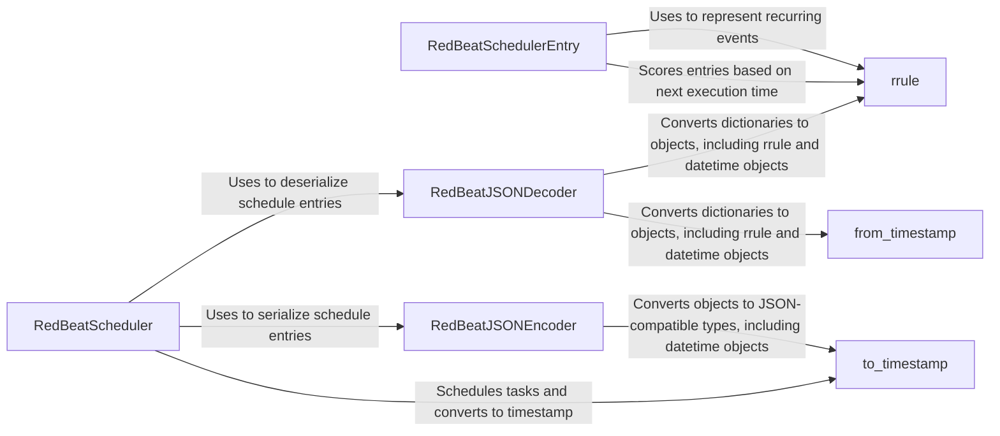

## Component Details

The RedBeat scheduler leverages Redis to manage and persist Celery beat schedules. It uses custom JSON encoding and decoding to serialize and deserialize schedule entries for storage in Redis. The core components include the scheduler, schedule entry representation, and JSON encoder/decoder, along with utility functions for timestamp conversion. These components work together to enable persistent and reliable scheduling of Celery tasks.

### RedBeatScheduler
The RedBeatScheduler class is responsible for managing and scheduling periodic tasks. It interacts with Redis to store and retrieve schedule entries, ensuring that tasks are executed at their scheduled times. It uses the RedBeatJSONEncoder and RedBeatJSONDecoder for serialization and deserialization of schedule entries.
- **Related Classes/Methods**: `redbeat.redbeat.schedulers.RedBeatScheduler`

### RedBeatSchedulerEntry
Represents a single entry in the RedBeat schedule. It encapsulates the task's schedule, arguments, and other relevant information. It handles scoring entries based on their next execution time, which is crucial for determining the order in which tasks should be executed.
- **Related Classes/Methods**: `redbeat.redbeat.schedulers.RedBeatSchedulerEntry`

### RedBeatJSONEncoder
Custom JSON encoder used to serialize RedBeat schedule entries to JSON strings for storage in Redis. It handles the conversion of objects to JSON-compatible types, including special handling for datetime objects and rrule objects, ensuring that the schedule information can be accurately stored and retrieved.
- **Related Classes/Methods**: `redbeat.redbeat.decoder.RedBeatJSONEncoder`

### RedBeatJSONDecoder
Custom JSON decoder used to deserialize RedBeat schedule entries from JSON strings stored in Redis. It handles the conversion of dictionaries to objects, including special handling for datetime and rrule objects. This ensures that the schedule information is correctly interpreted when retrieved from Redis.
- **Related Classes/Methods**: `redbeat.redbeat.decoder.RedBeatJSONDecoder`

### to_timestamp
A utility function to convert a datetime object to a timestamp (seconds since epoch). This is used by the encoder to convert datetime objects into a format that can be stored in Redis.
- **Related Classes/Methods**: `redbeat.redbeat.decoder.to_timestamp`

### from_timestamp
A utility function to convert a timestamp (seconds since epoch) to a datetime object. This is used by the decoder to convert timestamps retrieved from Redis back into datetime objects.
- **Related Classes/Methods**: `redbeat.redbeat.decoder.from_timestamp`

### rrule
The rrule class from the dateutil library, used to represent recurring events. It defines the rules for when a task should be executed repeatedly, such as daily, weekly, or monthly.
- **Related Classes/Methods**: `dateutil.rrule`
