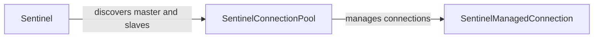

## Component Details

The Sentinel Management component provides high availability for Redis by monitoring Redis instances and automatically failing over to a slave if the master becomes unavailable. The core functionality involves discovering the master and slave nodes, managing connections to these nodes, and providing a proxy for clients to interact with the Redis cluster seamlessly during failover events. The `Sentinel` class discovers the Redis topology, `SentinelConnectionPool` manages connections, and `SentinelManagedConnection` handles individual connections.

### Sentinel
The `Sentinel` class is responsible for discovering the master and slave nodes in a Redis Sentinel setup. It initializes with a list of sentinel nodes and uses them to discover the topology of the Redis cluster. It provides methods to query the Sentinel servers for the current master and available slaves.
- **Related Classes/Methods**: `redis.sentinel.Sentinel`, `redis.asyncio.sentinel.Sentinel`

### SentinelConnectionPool
The `SentinelConnectionPool` manages a pool of connections to either the master or slave Redis instances. It is responsible for providing connections to the Redis clients and handling connection failures. It also handles the rotation of slaves to distribute the load.
- **Related Classes/Methods**: `redis.sentinel.SentinelConnectionPool`, `redis.asyncio.sentinel.SentinelConnectionPool`

### SentinelManagedConnection
The `SentinelManagedConnection` class represents a single connection to a Redis instance managed by Sentinel. It handles the connection and reconnection logic, as well as reading responses from the server. It is used by the connection pool to establish and maintain connections.
- **Related Classes/Methods**: `redis.sentinel.SentinelManagedConnection`, `redis.asyncio.sentinel.SentinelManagedConnection`
