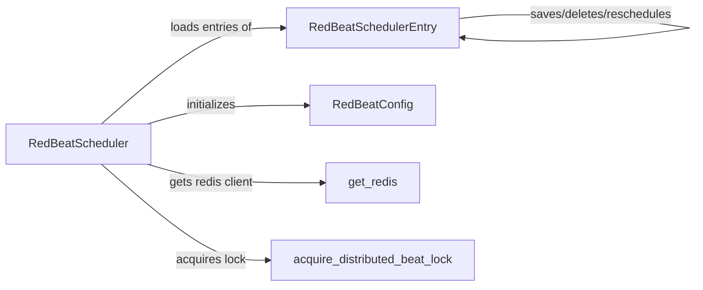

## Component Details

The Task Scheduling Orchestrator is responsible for managing and executing scheduled tasks within the Celery beat process. It initializes the task schedule from Redis, continuously monitors for tasks that are due for execution, and uses RedBeatEntry to schedule these tasks. The orchestrator also ensures that any changes to the schedule are persisted back to Redis, maintaining the schedule's state across Celery worker restarts. This system relies on a distributed lock to ensure only one beat process is active at a time, preventing duplicate task executions.

### RedBeatScheduler
The RedBeatScheduler is the core component responsible for managing the task schedule. It initializes the Redis connection, loads scheduled entries from Redis, and runs the scheduling loop. It uses RedBeatConfig for configuration, get_redis to interact with Redis, and acquire_distributed_beat_lock to ensure only one beat process is running.
- **Related Classes/Methods**: `redbeat.redbeat.schedulers.RedBeatScheduler`

### RedBeatSchedulerEntry
Represents a single entry in the schedule. It handles loading, saving, deleting, and rescheduling tasks. It also calculates the score and rank for task scheduling. It interacts with Redis to persist its state.
- **Related Classes/Methods**: `redbeat.redbeat.schedulers.RedBeatSchedulerEntry`

### RedBeatConfig
Configuration class for RedBeat, responsible for holding settings related to Redis connection details. It is used by RedBeatScheduler to configure the Redis connection.
- **Related Classes/Methods**: `redbeat.redbeat.schedulers.RedBeatConfig`

### get_redis
A function to get the redis client. It is used by RedBeatScheduler to interact with Redis.
- **Related Classes/Methods**: `redbeat.redbeat.schedulers:get_redis`

### acquire_distributed_beat_lock
A function to acquire distributed beat lock. It is used by RedBeatScheduler to ensure only one beat process is running.
- **Related Classes/Methods**: `redbeat.redbeat.schedulers:acquire_distributed_beat_lock`
