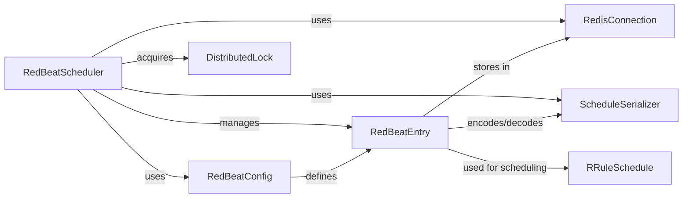

## Component Details

RedBeat extends Celery's beat scheduler to persist schedules in Redis, enabling dynamic schedule management and distributed execution. It allows users to define and modify task schedules at runtime, providing flexibility and scalability for Celery-based applications. The core components work together to manage schedules, connect to Redis, serialize data, and ensure tasks are executed according to their defined schedules.

### RedBeatScheduler
The central component responsible for managing and executing Celery tasks based on schedules stored in Redis. It retrieves schedules, determines task execution times, and triggers tasks accordingly. It also handles distributed locking to prevent multiple beat processes from running simultaneously.
- **Related Classes/Methods**: `redbeat.redbeat.schedulers.RedBeatScheduler`

### RedBeatEntry
Represents a single scheduled task, encapsulating its schedule, task details, and metadata. It handles loading, saving, and deleting schedule entries in Redis, as well as determining if a task is due for execution based on the schedule.
- **Related Classes/Methods**: `redbeat.redbeat.schedulers.RedBeatSchedulerEntry`

### RedBeatConfig
Manages the configuration settings for RedBeat, including Redis connection parameters, key prefixes, and other settings. It provides a centralized point for accessing and managing configuration values used throughout the RedBeat system.
- **Related Classes/Methods**: `redbeat.redbeat.schedulers.RedBeatConfig`

### RedisConnection
Handles the connection to the Redis server, including connection pooling, retry mechanisms, and configuration management. It provides a reliable and efficient interface for interacting with Redis, ensuring that RedBeat can consistently access and manage schedules.
- **Related Classes/Methods**: `redbeat.redbeat.schedulers.get_redis`, `redbeat.redbeat.schedulers.RetryingConnection`

### ScheduleSerializer
Responsible for serializing and deserializing schedule definitions to and from JSON format for storage in Redis. It handles the conversion of timestamps and other data types to ensure compatibility with Redis and consistent data representation.
- **Related Classes/Methods**: `redbeat.redbeat.decoder.RedBeatJSONDecoder`, `redbeat.redbeat.decoder.RedBeatJSONEncoder`, `redbeat.redbeat.decoder.to_timestamp`, `redbeat.redbeat.decoder.from_timestamp`

### RRuleSchedule
Implements scheduling based on recurrence rules (rrule), allowing for complex and flexible scheduling patterns. It integrates with the `dateutil` library to provide advanced scheduling capabilities, enabling users to define sophisticated schedules.
- **Related Classes/Methods**: `redbeat.redbeat.schedules.rrule`

### DistributedLock
Provides a mechanism for acquiring a distributed lock to prevent multiple beat processes from running concurrently and interfering with each other. It ensures that only one beat process is active at a time, preventing race conditions and data corruption.
- **Related Classes/Methods**: `redbeat.redbeat.schedulers.acquire_distributed_beat_lock`