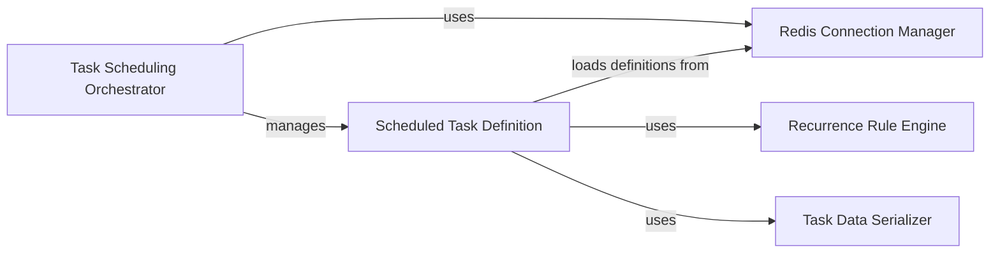

## Component Details

The RedBeat library extends Celery's beat scheduler to store schedules in Redis, enabling dynamic schedule management and persistence across Celery worker restarts. It provides a way to define and manage periodic tasks through a Redis-backed storage mechanism, offering greater flexibility and reliability compared to Celery's default scheduler.

### Task Scheduling Orchestrator
This component serves as the central orchestrator for managing and executing scheduled tasks. It initializes the schedule from Redis, continuously monitors for due tasks, and utilizes RedBeatEntry to schedule individual tasks. It also handles persistence of schedule changes back to Redis, ensuring that the task schedules are maintained even after Celery worker restarts.
- **Related Classes/Methods**: `redbeat.redbeat.schedulers.RedBeatScheduler`

### Scheduled Task Definition
This component represents a single scheduled task, encapsulating its definition, metadata, and scheduling logic. It handles loading task definitions from Redis, calculating the next due time using rrule, saving and deleting entries, and rescheduling tasks. It acts as an intermediary between the scheduler and the task definition stored in Redis, providing a consistent interface for managing individual tasks.
- **Related Classes/Methods**: `redbeat.redbeat.schedulers.RedBeatSchedulerEntry`

### Redis Connection Manager
This component manages the connection to the Redis server, including connection pooling, retries, and ensuring the connection is established. It provides a consistent interface for accessing Redis and abstracts away the underlying connection details, allowing other components to interact with Redis without needing to manage the connection directly.
- **Related Classes/Methods**: `redbeat.redbeat.schedulers.get_redis`, `redbeat.redbeat.schedulers.ensure_conf`

### Recurrence Rule Engine
This component defines the schedule definition for a task, using rrule to define the recurrence pattern. It encapsulates the logic for calculating the next due time based on the schedule and provides a consistent interface for accessing the schedule parameters, enabling flexible and complex scheduling configurations.
- **Related Classes/Methods**: `redbeat.redbeat.schedules.rrule`

### Task Data Serializer
This component handles the serialization and deserialization of task data to and from JSON format for storage in Redis. It ensures that task data is stored in a consistent format and can be easily retrieved and processed, enabling seamless storage and retrieval of task information within Redis.
- **Related Classes/Methods**: `redbeat.redbeat.decoder.RedBeatJSONDecoder`, `redbeat.redbeat.decoder.RedBeatJSONEncoder`