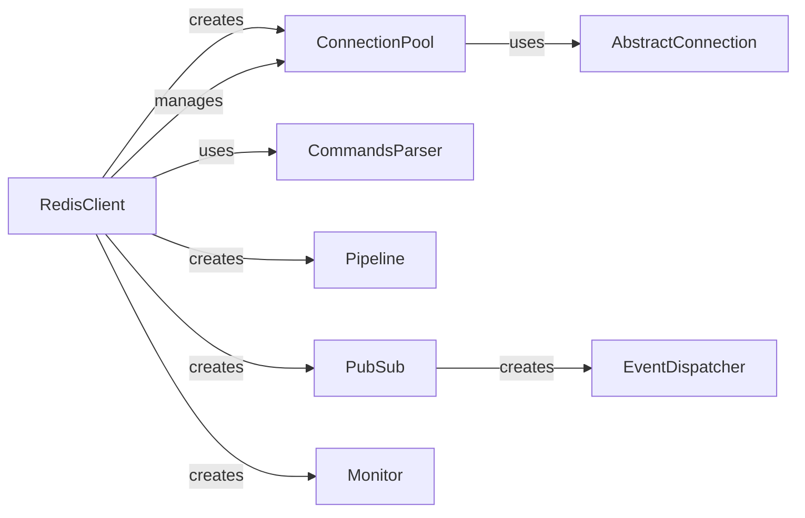

## Component Details

### RedisClient
The RedisClient class serves as the primary interface for interacting with the Redis server. It encapsulates connection management, command execution, and response handling. It supports various operations like setting and retrieving data, pub/sub, transactions, and scripting. The client can be configured with different connection pools and parsing strategies to optimize performance and resource utilization.
- **Related Classes/Methods**: `redis.client.Redis`, `redis.asyncio.client.Redis`, `redis.client.AbstractRedis`

### ConnectionPool
The ConnectionPool component manages a pool of reusable connections to the Redis server. It handles connection creation, recycling, and error handling, reducing the overhead of establishing new connections for each request. The pool can be configured with various parameters, such as the maximum number of connections and connection timeout, to optimize resource utilization and performance.
- **Related Classes/Methods**: `redis.connection.ConnectionPool`, `redis.asyncio.connection.ConnectionPool`

### CommandsParser
The CommandsParser component is responsible for parsing Redis commands and responses. It translates user-friendly method calls into Redis commands and converts the raw responses from the server into Python data types. The parser handles various data types, including strings, numbers, lists, and sets, and supports custom parsing logic for specific commands.
- **Related Classes/Methods**: `redis._parsers.commands.CommandsParser`, `redis._parsers.commands.AsyncCommandsParser`

### Pipeline
The Pipeline component enables the execution of multiple Redis commands in a single request, reducing network overhead and improving performance. It allows commands to be queued and executed atomically, ensuring data consistency. Pipelines are useful for performing batch operations and complex transactions.
- **Related Classes/Methods**: `redis.client.Pipeline`, `redis.asyncio.client.Pipeline`

### PubSub
The PubSub component provides an interface for interacting with Redis's publish/subscribe functionality. It allows clients to subscribe to channels and receive messages published to those channels. PubSub is useful for implementing real-time communication and event-driven architectures.
- **Related Classes/Methods**: `redis.client.PubSub`, `redis.asyncio.client.PubSub`

### Monitor
The Monitor component provides an interface for monitoring the Redis server. It allows clients to listen to all commands executed on the server, providing insights into server activity and performance. Monitor is useful for debugging, auditing, and performance analysis.
- **Related Classes/Methods**: `redis.client.Monitor`, `redis.asyncio.client.Monitor`

### EventDispatcher
The EventDispatcher component is responsible for dispatching events within the Redis client, particularly in the context of PubSub. It allows subscribers to register callbacks for specific events, such as message arrival or channel subscription, enabling asynchronous event handling.
- **Related Classes/Methods**: `redis.event.EventDispatcher`

### AbstractConnection
The AbstractConnection component defines the abstract base class for connections to the Redis server. It provides a common interface for sending commands, receiving responses, and handling connection errors. Concrete connection implementations, such as TCP connections or Unix domain socket connections, inherit from this class.
- **Related Classes/Methods**: `redis.connection.AbstractConnection`, `redis.asyncio.connection.AbstractConnection`
