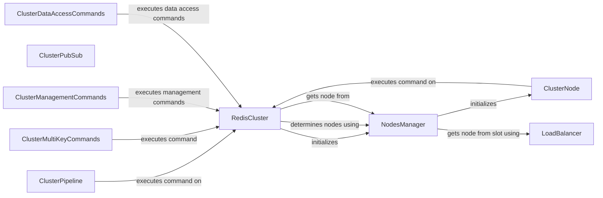

## Component Details

The Cluster Management component in Redis is responsible for handling the complexities of interacting with a Redis Cluster. It manages node discovery, slot assignment, and command routing to ensure commands are sent to the correct node. The core components include RedisCluster, which serves as the main entry point, NodesManager, which manages the cluster's nodes, and ClusterNode, which represents a single node in the cluster. LoadBalancer distributes the load across the nodes. ClusterPipeline enables pipelining, while ClusterPubSub implements pubsub functionality. Additionally, there are components for handling multi-key commands, management commands, and data access commands.

### RedisCluster
The main entry point for interacting with a Redis cluster. It handles cluster initialization, node discovery using NodesManager, and command routing. It determines the appropriate node for a given command and sends the command to that node.
- **Related Classes/Methods**: `redis.cluster.RedisCluster`, `redis.asyncio.cluster.RedisCluster`

### NodesManager
Manages the cluster's nodes, including discovering nodes, updating the node list, and providing access to individual nodes. It initializes ClusterNode objects and uses LoadBalancer to determine the node for a given slot.
- **Related Classes/Methods**: `redis.cluster.NodesManager`, `redis.asyncio.cluster.NodesManager`

### ClusterNode
Represents a single node in the Redis cluster. It encapsulates the connection details and provides methods for executing commands on that node. RedisCluster and NodesManager both interact with ClusterNode.
- **Related Classes/Methods**: `redis.cluster.ClusterNode`, `redis.asyncio.cluster.ClusterNode`

### LoadBalancer
Responsible for distributing the load across the available nodes in the cluster. NodesManager uses LoadBalancer to select a node for a given slot.
- **Related Classes/Methods**: `redis.cluster.LoadBalancer`

### ClusterPipeline
Implements pipelining for Redis clusters, allowing multiple commands to be sent to the cluster in a single request. It interacts with RedisCluster to execute commands.
- **Related Classes/Methods**: `redis.cluster.ClusterPipeline`, `redis.asyncio.cluster.ClusterPipeline`

### ClusterPubSub
Implements pubsub for Redis clusters, allowing publish and subscribe operations across the cluster.
- **Related Classes/Methods**: `redis.cluster.ClusterPubSub`

### ClusterMultiKeyCommands
Provides implementation for multi key commands. It executes commands via RedisCluster.
- **Related Classes/Methods**: `redis.commands.cluster.ClusterMultiKeyCommands`, `redis.commands.cluster.AsyncClusterMultiKeyCommands`

### ClusterManagementCommands
Provides implementation for cluster management commands. It executes management commands via RedisCluster.
- **Related Classes/Methods**: `redis.commands.cluster.ClusterManagementCommands`, `redis.commands.cluster.AsyncClusterManagementCommands`

### ClusterDataAccessCommands
Provides implementation for cluster data access commands. It executes data access commands via RedisCluster.
- **Related Classes/Methods**: `redis.commands.cluster.ClusterDataAccessCommands`, `redis.commands.cluster.AsyncClusterDataAccessCommands`
