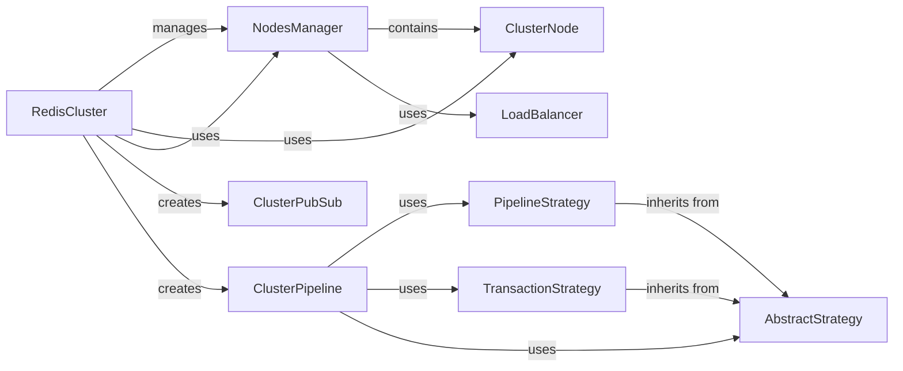

## Component Details

### RedisCluster
Represents a Redis Cluster client. It handles connection management, command execution, and data sharding across multiple Redis nodes. It initializes and manages the NodesManager, and provides methods for executing commands, creating pipelines, and handling PubSub.
- **Related Classes/Methods**: `redis.cluster.RedisCluster`, `redis.asyncio.cluster.RedisCluster`

### NodesManager
Manages the cluster nodes, including discovering, updating, and maintaining information about the nodes in the cluster. It is responsible for node discovery, slot assignment, and connection management. It uses a LoadBalancer to distribute requests among replica nodes.
- **Related Classes/Methods**: `redis.cluster.NodesManager`, `redis.asyncio.cluster.NodesManager`

### ClusterNode
Represents a single node in the Redis Cluster, storing its host, port, and other relevant information. It provides methods for acquiring connections and executing commands on the node.
- **Related Classes/Methods**: `redis.cluster.ClusterNode`, `redis.asyncio.cluster.ClusterNode`

### ClusterPubSub
Implements PubSub functionality for Redis Cluster, allowing clients to subscribe to channels and receive messages. It extends the base PubSub class and adds cluster-specific logic for handling subscriptions and message distribution.
- **Related Classes/Methods**: `redis.cluster.ClusterPubSub`

### ClusterPipeline
Provides pipeline functionality for Redis Cluster, allowing clients to execute multiple commands in a single request. It extends the base Pipeline class and adds cluster-specific logic for command grouping and routing.
- **Related Classes/Methods**: `redis.cluster.ClusterPipeline`

### PipelineStrategy
Handles the execution strategy for pipelines, including command grouping and sending commands to the appropriate nodes. It inherits from AbstractStrategy and implements the execute_command method.
- **Related Classes/Methods**: `redis.cluster.PipelineStrategy`

### TransactionStrategy
Handles the execution strategy for transactions, ensuring atomicity and consistency across multiple nodes. It inherits from AbstractStrategy and implements the execute_command method.
- **Related Classes/Methods**: `redis.cluster.TransactionStrategy`

### AbstractStrategy
Abstract class that defines common methods for PipelineStrategy and TransactionStrategy. It provides a base class for handling command execution in a cluster environment.
- **Related Classes/Methods**: `redis.cluster.AbstractStrategy`

### LoadBalancer
Distributes requests among replica nodes to improve read performance and availability. It is used by the NodesManager to select the appropriate node for read operations.
- **Related Classes/Methods**: `redis.cluster.LoadBalancer`
