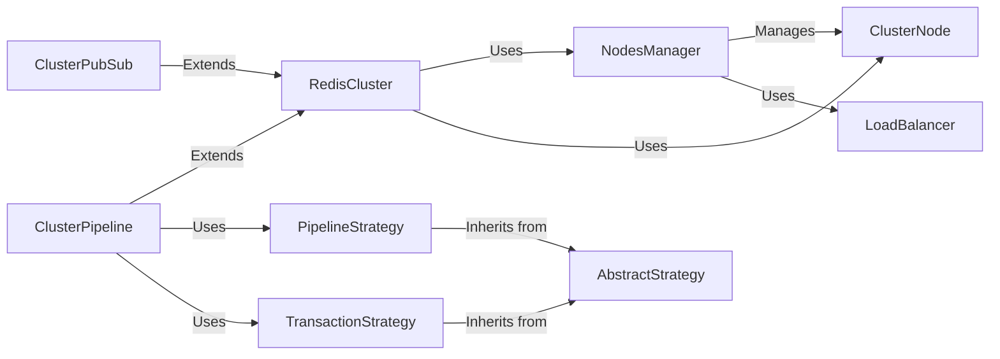

## Component Details

### RedisCluster
The RedisCluster component serves as the primary interface for interacting with a Redis Cluster. It manages connections to multiple Redis nodes, handles command routing based on slot assignment, and provides methods for executing commands, including support for pipelines and pub/sub. It relies on the NodesManager to maintain an updated view of the cluster topology and to select the appropriate nodes for command execution. It abstracts away the complexities of interacting with a distributed Redis environment, providing a unified interface for data access and manipulation.
- **Related Classes/Methods**: `redis.cluster.RedisCluster`, `redis.asyncio.cluster.RedisCluster`

### NodesManager
The NodesManager component is responsible for maintaining an up-to-date view of the Redis Cluster topology. It discovers and monitors the cluster nodes, tracks their roles (master or replica), and manages the mapping of slots to nodes. It uses the ClusterNode component to represent individual nodes and the LoadBalancer component to distribute read operations across replicas. It provides methods for updating the cluster topology and for retrieving information about the nodes and their slots.
- **Related Classes/Methods**: `redis.cluster.NodesManager`, `redis.asyncio.cluster.NodesManager`

### ClusterNode
The ClusterNode component represents a single node within the Redis Cluster. It stores information about the node, such as its host, port, and node ID. It is managed by the NodesManager and used by the RedisCluster component for command execution. It provides methods for establishing and managing connections to the node.
- **Related Classes/Methods**: `redis.cluster.ClusterNode`, `redis.asyncio.cluster.ClusterNode`

### LoadBalancer
The LoadBalancer component is responsible for distributing read operations across the replica nodes in the Redis Cluster. It uses a load-balancing algorithm to select the most appropriate replica for each read operation, ensuring that the load is evenly distributed across the cluster. It is used by the NodesManager to select replica nodes for read operations.
- **Related Classes/Methods**: `redis.cluster.LoadBalancer`

### ClusterPubSub
The ClusterPubSub component extends the Redis Pub/Sub functionality to support Redis Cluster. It manages subscriptions and message distribution across the cluster, ensuring that messages are delivered to all subscribers, regardless of which node they are connected to. It uses the RedisCluster component for interacting with the cluster.
- **Related Classes/Methods**: `redis.cluster.ClusterPubSub`

### ClusterPipeline
The ClusterPipeline component extends the Redis Pipeline functionality to support Redis Cluster. It allows executing multiple commands in a single request, optimizing performance by reducing the number of round trips to the server. It uses the PipelineStrategy and TransactionStrategy components for executing pipelined commands.
- **Related Classes/Methods**: `redis.cluster.ClusterPipeline`, `redis.asyncio.cluster.ClusterPipeline`

### PipelineStrategy
The PipelineStrategy component handles the execution of pipelined commands in a Redis Cluster. It determines the target nodes for each command and sends the commands accordingly. It inherits from the AbstractStrategy component, providing common functionality for command execution and error handling.
- **Related Classes/Methods**: `redis.cluster.PipelineStrategy`

### TransactionStrategy
The TransactionStrategy component handles the execution of transactional commands in a Redis Cluster, ensuring atomicity and consistency. It inherits from the AbstractStrategy component, providing common functionality for command execution and error handling.
- **Related Classes/Methods**: `redis.cluster.TransactionStrategy`

### AbstractStrategy
The AbstractStrategy component serves as the abstract base class for pipeline and transaction strategies, providing common functionality for command execution and error handling. It defines the interface for executing commands and handling errors, which are then implemented by the concrete strategy classes.
- **Related Classes/Methods**: `redis.cluster.AbstractStrategy`
