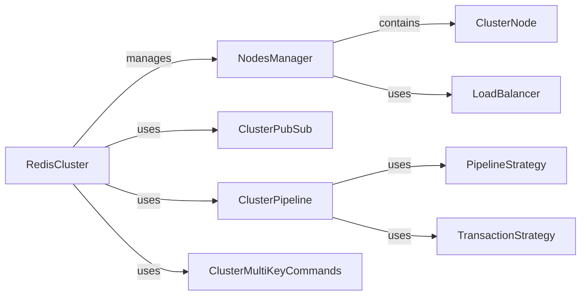

## Component Details

### RedisCluster
The RedisCluster class serves as the primary interface for interacting with a Redis Cluster. It encapsulates the complexities of managing connections to multiple Redis nodes, routing commands based on key hashing, and handling cluster topology changes. It provides methods for executing Redis commands, managing pub/sub subscriptions, and performing pipeline operations within the cluster.
- **Related Classes/Methods**: `redis.cluster.RedisCluster`, `redis.asyncio.cluster.RedisCluster`

### NodesManager
The NodesManager component is responsible for maintaining an up-to-date view of the Redis Cluster topology. It discovers new nodes, monitors the health of existing nodes, and updates the slot distribution map. It also manages the connections to the individual Redis nodes, providing a pool of connections for executing commands.
- **Related Classes/Methods**: `redis.cluster.NodesManager`, `redis.asyncio.cluster.NodesManager`

### ClusterNode
The ClusterNode class represents a single node within the Redis Cluster. It stores information about the node's host, port, and role (primary or replica). It is used by the NodesManager to track the individual nodes in the cluster and their associated connections.
- **Related Classes/Methods**: `redis.cluster.ClusterNode`, `redis.asyncio.cluster.ClusterNode`

### ClusterPubSub
The ClusterPubSub class extends the Redis PubSub functionality to support Redis Cluster. It handles the distribution of messages across the cluster nodes, ensuring that subscribers receive messages published to the appropriate channels.
- **Related Classes/Methods**: `redis.cluster.ClusterPubSub`

### ClusterPipeline
The ClusterPipeline class extends the Redis Pipeline functionality to support Redis Cluster. It allows executing multiple commands in a single request, improving performance by reducing network round trips. The pipeline intelligently routes commands to the appropriate nodes based on key hashing.
- **Related Classes/Methods**: `redis.cluster.ClusterPipeline`

### PipelineStrategy
The PipelineStrategy component is responsible for determining the target nodes for each command in a pipeline and sending the commands to the appropriate nodes. It ensures that commands are executed on the correct nodes based on the key hashing and cluster topology.
- **Related Classes/Methods**: `redis.cluster.PipelineStrategy`

### TransactionStrategy
The TransactionStrategy component handles the execution of transactions in a Redis Cluster. It ensures that all commands in a transaction are executed on the same node, maintaining atomicity and consistency.
- **Related Classes/Methods**: `redis.cluster.TransactionStrategy`

### ClusterMultiKeyCommands
The ClusterMultiKeyCommands component implements multi-key commands for Redis Cluster. It partitions the keys by slot and executes the commands on the appropriate nodes, handling the complexities of distributing multi-key operations across the cluster.
- **Related Classes/Methods**: `redis.commands.cluster.ClusterMultiKeyCommands`

### LoadBalancer
The LoadBalancer component balances the load between replica nodes in a Redis Cluster. It selects the appropriate replica node for read operations, distributing the load and improving performance.
- **Related Classes/Methods**: `redis.cluster.LoadBalancer`
