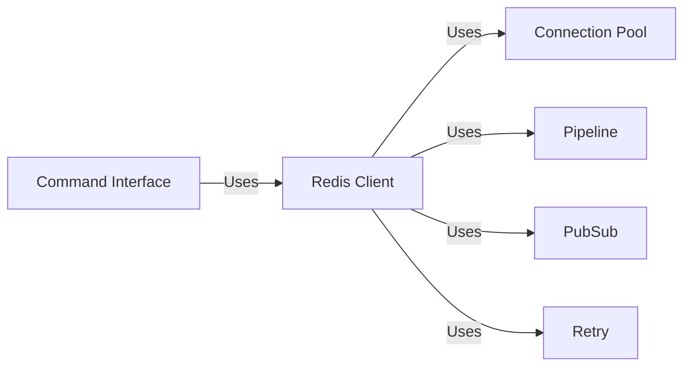

## Component Details

### Redis Client
The Redis client provides the primary interface for interacting with a Redis server. It encapsulates connection management, command execution, and response handling. It utilizes a connection pool for efficient connection reuse and supports various functionalities like pipelining, pub/sub, and monitoring.
- **Related Classes/Methods**: `redis.client.Redis`, `redis.asyncio.client.Redis`

### Connection Pool
The Connection Pool manages a set of connections to the Redis server. It handles the creation, recycling, and error handling of connections, optimizing resource utilization and improving performance. The connection pool is used by the Redis client to execute commands.
- **Related Classes/Methods**: `redis.connection.ConnectionPool`, `redis.asyncio.connection.ConnectionPool`

### Command Interface
The Command Interface offers a high-level, user-friendly way to execute Redis commands. It includes functionalities for key management, data manipulation (strings, lists, sets, sorted sets, hashes, streams), and server management. It relies on the Redis Client for connection and command execution, abstracting away the low-level details of interacting with the Redis server.
- **Related Classes/Methods**: `redis.commands.core.BasicKeyCommands`, `redis.commands.core.ListCommands`, `redis.commands.core.SetCommands`, `redis.commands.core.SortedSetCommands`, `redis.commands.core.HashCommands`, `redis.commands.core.StreamCommands`, `redis.commands.core.HyperlogCommands`, `redis.commands.core.GeoCommands`, `redis.commands.core.ManagementCommands`, `redis.commands.core.ACLCommands`, `redis.commands.core.ScriptCommands`, `redis.commands.core.FunctionCommands`, `redis.commands.core.ModuleCommands`

### Pipeline
The Pipeline component enables batching multiple commands into a single request to the Redis server, significantly improving performance by reducing network round trips. It supports both transactional and non-transactional pipelines, allowing for atomic execution of command sequences.
- **Related Classes/Methods**: `redis.client.Pipeline`, `redis.asyncio.client.Pipeline`

### PubSub
The PubSub component provides an interface for subscribing to and publishing messages on Redis channels. It manages connection details, message parsing, and subscription management, enabling real-time communication between applications.
- **Related Classes/Methods**: `redis.client.PubSub`, `redis.asyncio.client.PubSub`

### Retry
The Retry component provides a mechanism for automatically retrying failed commands, enhancing the reliability of the system. It uses a backoff strategy to avoid overwhelming the server with retries, ensuring graceful recovery from transient errors.
- **Related Classes/Methods**: `redis.retry.Retry`, `redis.asyncio.retry.Retry`
