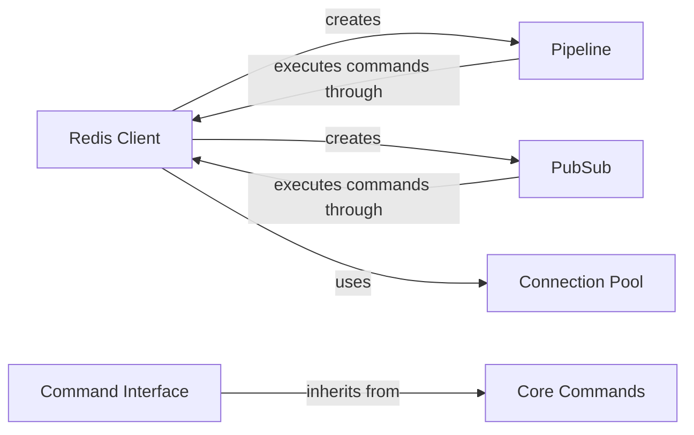

## Component Details

### Redis Client
The core client class for interacting with a Redis server. It manages connections, executes commands, and parses responses. It provides methods for interacting with the Redis server, such as sending commands and receiving responses.
- **Related Classes/Methods**: `redis.client.Redis`, `redis.asyncio.client.Redis`

### Command Interface
Provides a high-level interface for executing Redis commands, abstracting the underlying complexities of the Redis protocol. It includes command categories like key management, data manipulation, and server management. This component simplifies the interaction with Redis by providing convenient methods for executing commands and handling responses.
- **Related Classes/Methods**: `redis.commands.core.BasicKeyCommands`, `redis.commands.core.ListCommands`, `redis.commands.core.SetCommands`, `redis.commands.core.SortedSetCommands`, `redis.commands.core.HashCommands`, `redis.commands.core.StreamCommands`, `redis.commands.core.HyperlogCommands`, `redis.commands.core.GeoCommands`, `redis.commands.core.ManagementCommands`, `redis.commands.core.ACLCommands`, `redis.commands.core.ScriptCommands`, `redis.commands.core.FunctionCommands`, `redis.commands.core.ModuleCommands`

### Core Commands
Base class for command implementations, providing shared functionality and command execution logic. It serves as the foundation for all specific command implementations, offering common methods and attributes.
- **Related Classes/Methods**: `redis.commands.core.CoreCommands`, `redis.commands.core.AsyncCoreCommands`

### Pipeline
Enables batch execution of Redis commands, improving performance. Supports transactions and optimistic locking. It allows grouping multiple commands into a single request, reducing network overhead and improving efficiency.
- **Related Classes/Methods**: `redis.client.Pipeline`, `redis.asyncio.client.Pipeline`

### PubSub
Facilitates interaction with Redis's Pub/Sub functionality, allowing subscription to channels/patterns and message publishing/receiving. It enables real-time communication between applications by allowing them to subscribe to channels and receive messages published to those channels.
- **Related Classes/Methods**: `redis.client.PubSub`, `redis.asyncio.client.PubSub`

### Connection Pool
Manages a pool of connections to the Redis server, handling connection creation, reuse, and cleanup. It optimizes connection management by maintaining a pool of active connections, reducing the overhead of establishing new connections for each request.
- **Related Classes/Methods**: `redis.connection.ConnectionPool`, `redis.asyncio.connection.ConnectionPool`
