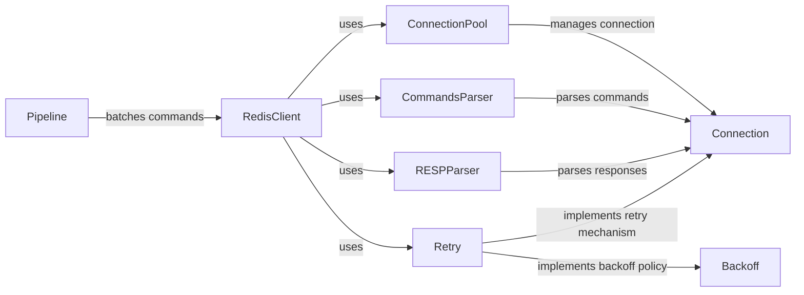

## Component Details

### RedisClient
The RedisClient class provides a high-level interface for interacting with a Redis server. It encapsulates connection management, command execution, and response parsing, offering both synchronous and asynchronous implementations. It handles the complexities of interacting with the Redis server, allowing users to focus on the application logic.
- **Related Classes/Methods**: `redis.client.Redis`, `redis.asyncio.client.Redis`

### Pipeline
The Pipeline class enables batching multiple commands into a single request to the Redis server, reducing network overhead and improving performance. It supports both synchronous and asynchronous operations, and it can be used with both regular Redis clients and Redis Cluster clients. It optimizes command execution by grouping commands together.
- **Related Classes/Methods**: `redis.client.Pipeline`, `redis.asyncio.client.Pipeline`, `redis.cluster.ClusterPipeline`, `redis.asyncio.cluster.ClusterPipeline`

### Connection
The Connection class manages the connection to the Redis server. It handles socket creation, connection establishment, command sending, and response reading. It provides the low-level communication layer for interacting with Redis.
- **Related Classes/Methods**: `redis.connection.Connection`, `redis.asyncio.connection.Connection`

### CommandsParser
The CommandsParser is responsible for parsing the commands and their arguments before sending them to the Redis server. It ensures that the commands are properly formatted and valid, and it handles the serialization of command arguments into the Redis protocol format. It prepares the commands for transmission to the server.
- **Related Classes/Methods**: `redis._parsers.commands.CommandsParser`, `redis._parsers.commands.AsyncCommandsParser`

### RESPParser
The RESPParser handles the parsing of responses received from the Redis server, converting them into Python data types. It supports different versions of the Redis Serialization Protocol (RESP), including RESP2 and RESP3, as well as the Hiredis parser for improved performance. It translates the server's responses into usable data.
- **Related Classes/Methods**: `redis._parsers.resp2._RESP2Parser`, `redis._parsers.resp3._RESP3Parser`, `redis._parsers.hiredis._HiredisParser`

### Retry
The Retry class provides a mechanism for automatically retrying failed operations, improving the reliability of Redis interactions. It defines the retry strategy, backoff policy, and error handling logic, allowing for customizable retry behavior. It ensures that operations are eventually successful, even in the face of transient errors.
- **Related Classes/Methods**: `redis.retry.Retry`, `redis.asyncio.retry.Retry`

### Backoff
The Backoff classes implement different backoff policies, determining the delay between retries. This helps to avoid overwhelming the Redis server with repeated requests after a failure. Different backoff strategies can be used, such as no backoff or exponential backoff with jitter.
- **Related Classes/Methods**: `redis.backoff.NoBackoff`, `redis.backoff.ExponentialWithJitterBackoff`

### ConnectionPool
The ConnectionPool manages a pool of connections to the Redis server, allowing for efficient reuse of connections and reducing the overhead of establishing new connections for each request. It provides a thread-safe way to manage connections in a concurrent environment.
- **Related Classes/Methods**: `redis.connection.ConnectionPool`, `redis.asyncio.connection.ConnectionPool`
