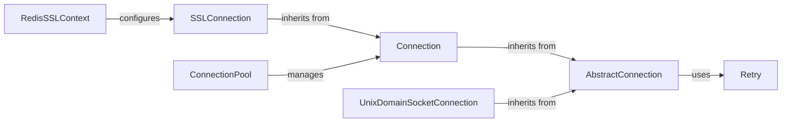

## Component Details

### AbstractConnection
Abstract base class for Redis connections, defining the interface for connecting, disconnecting, sending commands, and receiving responses. It manages connection state, encoding, and retry logic, providing a foundation for concrete connection implementations.
- **Related Classes/Methods**: `redis.connection.AbstractConnection`, `redis.asyncio.connection.AbstractConnection`

### Connection
A standard Redis connection class that extends AbstractConnection and provides socket-based communication. It handles socket operations for sending commands and receiving responses, implementing the core communication logic for TCP connections.
- **Related Classes/Methods**: `redis.connection.Connection`, `redis.asyncio.connection.Connection`

### SSLConnection
A secure Redis connection class that extends Connection and adds SSL/TLS encryption to the communication. It handles the SSL handshake and encrypts/decrypts data transmitted over the socket, ensuring secure communication with the Redis server.
- **Related Classes/Methods**: `redis.connection.SSLConnection`, `redis.asyncio.connection.SSLConnection`

### UnixDomainSocketConnection
A Redis connection class that extends AbstractConnection and uses Unix domain sockets for communication. It provides a way to connect to Redis without using TCP, which can be useful for local connections, offering an alternative communication channel.
- **Related Classes/Methods**: `redis.connection.UnixDomainSocketConnection`, `redis.asyncio.connection.UnixDomainSocketConnection`

### ConnectionPool
Manages a pool of Redis connections, allowing for efficient reuse of connections and improved performance. It handles connection creation, release, and recycling, optimizing connection management for concurrent operations.
- **Related Classes/Methods**: `redis.connection.ConnectionPool`, `redis.asyncio.connection.ConnectionPool`, `redis.connection.BlockingConnectionPool`, `redis.asyncio.connection.BlockingConnectionPool`

### Retry
Handles retrying failed operations with configurable backoff strategies. It encapsulates the logic for determining when and how to retry a command, enhancing the reliability of Redis operations.
- **Related Classes/Methods**: `redis.retry.Retry`, `redis.asyncio.retry.Retry`

### RedisSSLContext
Configures SSL context for secure Redis connections. It encapsulates the SSL context creation and configuration, simplifying the setup of secure connections.
- **Related Classes/Methods**: `redis.asyncio.connection.RedisSSLContext`
