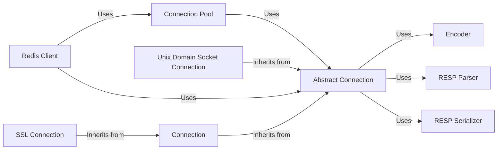

## Component Details

### Redis Client
The Redis Client component provides a high-level interface for interacting with a Redis server. It encapsulates connection management, command execution, and response handling. It uses a connection pool to efficiently manage connections and an encoder/decoder to serialize/deserialize data. It offers methods for executing various Redis commands and retrieving results.
- **Related Classes/Methods**: `redis.client.Redis`, `redis.asyncio.client.Redis`

### Abstract Connection
The Abstract Connection component defines the base class for all Redis connections. It provides the fundamental connection lifecycle methods, including connecting, disconnecting, sending commands, and receiving responses. It uses an encoder to serialize commands and a parser to deserialize responses. It also manages connection-related events and retries.
- **Related Classes/Methods**: `redis.connection.AbstractConnection`, `redis.asyncio.connection.AbstractConnection`

### Connection
The Connection component implements a standard TCP socket connection to a Redis server. It inherits the connection lifecycle methods from AbstractConnection and provides the specific implementation for TCP socket communication. It handles the low-level details of sending and receiving data over the socket.
- **Related Classes/Methods**: `redis.connection.Connection`, `redis.asyncio.connection.Connection`

### SSL Connection
The SSL Connection component extends the Connection component to provide secure communication over SSL/TLS. It adds SSL/TLS encryption to the TCP socket connection, ensuring data confidentiality and integrity. It inherits the connection lifecycle methods from Connection and adds the necessary SSL/TLS handshake and encryption logic.
- **Related Classes/Methods**: `redis.connection.SSLConnection`, `redis.asyncio.connection.SSLConnection`

### Unix Domain Socket Connection
The Unix Domain Socket Connection component provides a connection to a Redis server over a Unix domain socket. It inherits the connection lifecycle methods from AbstractConnection and provides the specific implementation for Unix domain socket communication. It is used for local Redis instances where TCP socket communication is not necessary.
- **Related Classes/Methods**: `redis.connection.UnixDomainSocketConnection`, `redis.asyncio.connection.UnixDomainSocketConnection`

### Connection Pool
The Connection Pool component manages a pool of Redis connections, providing connection reuse and efficient resource management. It handles connection creation, recycling, and distribution to clients. It uses AbstractConnection to create and manage individual connections. It also supports blocking and non-blocking connection acquisition.
- **Related Classes/Methods**: `redis.connection.ConnectionPool`, `redis.asyncio.connection.ConnectionPool`

### Encoder
The Encoder component is responsible for encoding Python objects into the Redis serialization protocol (RESP) format. It handles the conversion of various data types, such as strings, integers, and lists, into the appropriate RESP representation. It is used by AbstractConnection to serialize commands before sending them to the Redis server.
- **Related Classes/Methods**: `redis._parsers.encoders.Encoder`

### RESP Parser
The RESP Parser component is responsible for parsing responses from the Redis server, which are encoded in the Redis Serialization Protocol (RESP). It takes the raw bytes received from the server and converts them into Python data structures. There are different implementations for RESP2, RESP3 and Hiredis.
- **Related Classes/Methods**: `redis._parsers.resp2._RESP2Parser`, `redis._parsers.resp3._RESP3Parser`, `redis._parsers.hiredis._HiredisParser`, `redis._parsers.helpers`

### RESP Serializer
The RESP Serializer component is responsible for serializing commands to be sent to the Redis server. There are two implementations, one in Python and one in Hiredis (C library).
- **Related Classes/Methods**: `redis.connection.HiredisRespSerializer`, `redis.connection.PythonRespSerializer`
