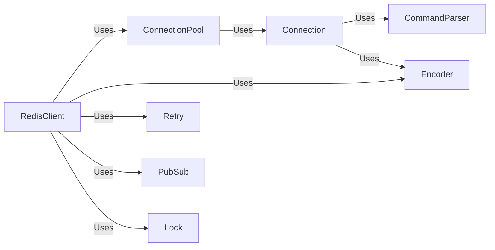

## Component Details

### RedisClient
Represents a Redis client, providing methods for interacting with a Redis server. It manages connection pools, command execution, and response parsing. It serves as the primary interface for users to interact with Redis, offering methods for various Redis operations.
- **Related Classes/Methods**: `redis.client.Redis`, `redis.asyncio.client.Redis`

### ConnectionPool
Manages a pool of connections to a Redis server, handling connection creation, recycling, and distribution to clients. It optimizes connection reuse and reduces the overhead of establishing new connections for each request.
- **Related Classes/Methods**: `redis.connection.ConnectionPool`, `redis.asyncio.connection.ConnectionPool`

### Connection
Represents a single connection to a Redis server. It handles socket communication, command serialization, and response deserialization. It provides the low-level communication channel for sending commands and receiving responses.
- **Related Classes/Methods**: `redis.connection.Connection`, `redis.asyncio.connection.Connection`, `redis.connection.AbstractConnection`, `redis.asyncio.connection.AbstractConnection`, `redis.connection.SSLConnection`, `redis.asyncio.connection.SSLConnection`, `redis.connection.UnixDomainSocketConnection`, `redis.asyncio.connection.UnixDomainSocketConnection`

### CommandParser
Parses Redis responses according to the RESP2 or RESP3 protocol. It handles different data types and errors. It ensures that the data received from the Redis server is correctly interpreted and converted into Python objects.
- **Related Classes/Methods**: `redis._parsers.base.BaseParser`, `redis._parsers.resp2._RESP2Parser`, `redis._parsers.resp3._RESP3Parser`, `redis._parsers.hiredis._HiredisParser`, `redis._parsers.hiredis._AsyncHiredisParser`, `redis._parsers.resp2._AsyncRESP2Parser`, `redis._parsers.resp3._AsyncRESP3Parser`

### Encoder
Encodes Python objects into the Redis serialization protocol (RESP) format for sending commands to the server. It handles the conversion of Python data types into a format that Redis can understand.
- **Related Classes/Methods**: `redis._parsers.encoders.Encoder`

### Retry
Handles retrying failed Redis operations based on configured strategies. It improves the resilience of the client by automatically retrying commands that fail due to transient errors.
- **Related Classes/Methods**: `redis.retry.Retry`, `redis.asyncio.retry.Retry`

### PubSub
Implements the Pub/Sub functionality, allowing clients to subscribe to channels and receive messages. It enables real-time communication between clients through a publish-subscribe messaging pattern.
- **Related Classes/Methods**: `redis.client.PubSub`, `redis.asyncio.client.PubSub`

### Lock
Provides a distributed lock implementation using Redis. It ensures that only one client can access a shared resource at a time, preventing race conditions and data corruption.
- **Related Classes/Methods**: `redis.lock.Lock`, `redis.asyncio.lock.Lock`
