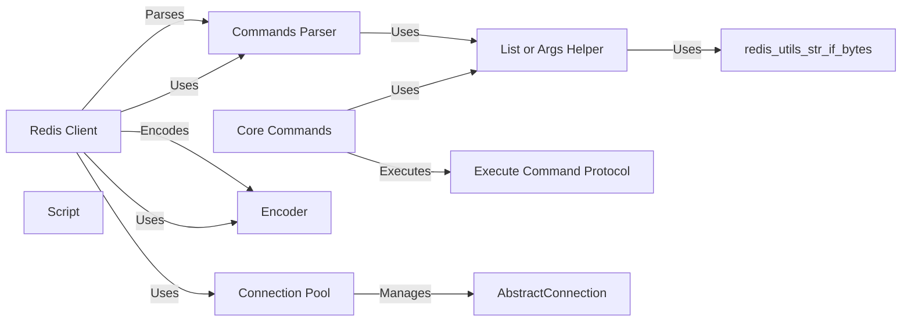

## Component Details

### Redis Client
The Redis client class (`redis.client.Redis`) serves as the primary interface for interacting with a Redis server. It encapsulates connection management, command execution, and response parsing. The client provides methods corresponding to Redis commands, allowing users to perform operations such as setting and retrieving data, managing keys, and subscribing to Pub/Sub channels. It relies on a connection pool for efficient connection reuse and an encoder for serializing data.
- **Related Classes/Methods**: `redis/client.py`

### Connection Pool
The Connection Pool (`redis.connection.ConnectionPool`) manages a pool of connections to the Redis server. It handles connection creation, recycling, and selection for use by the Redis client. The connection pool aims to reduce the overhead of establishing new connections for each command, improving performance. It is used by the Redis client to obtain connections for executing commands.
- **Related Classes/Methods**: `redis/connection.py`

### Commands Parser
The Commands Parser (`redis._parsers.commands.CommandsParser`) is responsible for parsing Redis commands and extracting keys from them. It analyzes the command structure to identify the keys involved, which is crucial for operations like clustering and command routing. It uses `redis.utils.str_if_bytes` to decode bytes to string if the input is bytes.
- **Related Classes/Methods**: `redis/_parsers/commands.py`

### Encoder
The Encoder (`redis._parsers.encoders.Encoder`) encodes Python objects into Redis format for sending commands to the server. It handles the serialization of data types such as strings, numbers, and booleans into the Redis protocol. The encoder is used by the Redis client to prepare commands for transmission.
- **Related Classes/Methods**: `redis/_parsers/encoders.py`

### Core Commands
The Core Commands (`redis.commands.core`) module groups the implementation of all the core redis commands like keys, strings, lists, sets, etc. These classes define methods that map directly to Redis commands, providing a high-level interface for interacting with the server. They use `redis.typing.CommandsProtocol.execute_command` to execute the commands and `redis.commands.helpers.list_or_args` to handle variable arguments.
- **Related Classes/Methods**: `redis/commands/core.py`

### Script
The Script component (`redis.commands.core.Script`) represents a Redis script, allowing it to be loaded and executed on the server. It encapsulates the script's source code and provides methods for loading, executing, and managing the script. It is part of the core commands.
- **Related Classes/Methods**: `redis/commands/core.py`

### List or Args Helper
The `list_or_args` helper function (`redis.commands.helpers.list_or_args`) is used to handle commands that accept either a list or variable arguments. It simplifies the command implementation by providing a consistent way to process arguments regardless of their format. It uses `redis.utils.str_if_bytes` to decode bytes to string if the input is bytes.
- **Related Classes/Methods**: `redis/commands/helpers.py`

### Execute Command Protocol
The `execute_command` abstract method (`redis.typing.CommandsProtocol.execute_command`) defines the interface for executing a command. It is implemented by the Redis client and used by the command classes to send commands to the server. It is the low level command execution.
- **Related Classes/Methods**: `redis/typing.py`
