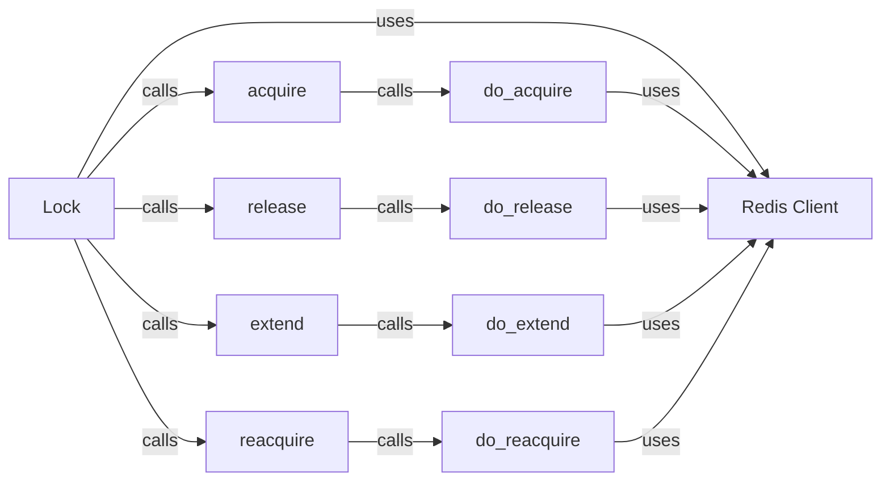

## Component Details

### Lock
The Lock class provides a distributed locking mechanism using Redis. It allows clients to acquire, release, extend, and reacquire locks, ensuring exclusive access to shared resources. It uses Lua scripts for atomic operations and thread-local storage to manage lock ownership.
- **Related Classes/Methods**: `repos.redis-py.redis.lock.Lock`, `repos.redis-py.redis.asyncio.lock.Lock`

### acquire
The acquire method attempts to acquire the lock, blocking until it is obtained or the timeout expires. It internally calls the do_acquire method to perform the actual lock acquisition logic.
- **Related Classes/Methods**: `repos.redis-py.redis.lock.Lock:acquire`, `repos.redis-py.redis.asyncio.lock.Lock:acquire`

### release
The release method releases the lock, allowing other clients to acquire it. It internally calls the do_release method to perform the actual lock release logic and raises a LockNotOwnedError if the lock is not owned by the client.
- **Related Classes/Methods**: `repos.redis-py.redis.lock.Lock:release`, `repos.redis-py.redis.asyncio.lock.Lock:release`

### extend
The extend method extends the lock's expiration time, preventing it from being automatically released. It internally calls the do_extend method to perform the actual lock extension logic and raises a LockNotOwnedError if the lock is not owned by the client.
- **Related Classes/Methods**: `repos.redis-py.redis.lock.Lock:extend`, `repos.redis-py.redis.asyncio.lock.Lock:extend`

### reacquire
The reacquire method reacquires the lock if it has been lost due to expiration or other reasons. It internally calls the do_reacquire method to perform the actual lock reacquisition logic and raises a LockNotOwnedError if the lock is not owned by the client.
- **Related Classes/Methods**: `repos.redis-py.redis.lock.Lock:reacquire`, `repos.redis-py.redis.asyncio.lock.Lock:reacquire`

### do_acquire
The do_acquire method is an internal method that handles the actual lock acquisition logic by interacting with the Redis server.
- **Related Classes/Methods**: `repos.redis-py.redis.lock.Lock:do_acquire`, `repos.redis-py.redis.asyncio.lock.Lock:do_acquire`

### do_release
The do_release method is an internal method that handles the actual lock release logic by interacting with the Redis server.
- **Related Classes/Methods**: `repos.redis-py.redis.lock.Lock:do_release`, `repos.redis-py.redis.asyncio.lock.Lock:do_release`

### do_extend
The do_extend method is an internal method that handles the actual lock extension logic by interacting with the Redis server.
- **Related Classes/Methods**: `repos.redis-py.redis.lock.Lock:do_extend`, `repos.redis-py.redis.asyncio.lock.Lock:do_extend`

### do_reacquire
The do_reacquire method is an internal method that handles the actual lock reacquisition logic by interacting with the Redis server.
- **Related Classes/Methods**: `repos.redis-py.redis.lock.Lock:do_reacquire`, `repos.redis-py.redis.asyncio.lock.Lock:do_reacquire`

### Redis Client
The Redis client instance is used by the Lock class and its internal methods (do_acquire, do_release, do_extend, do_reacquire) to interact with the Redis server for performing lock operations.
- **Related Classes/Methods**: `repos.redis-py.redis.lock.Lock`, `repos.redis-py.redis.asyncio.lock.Lock`
