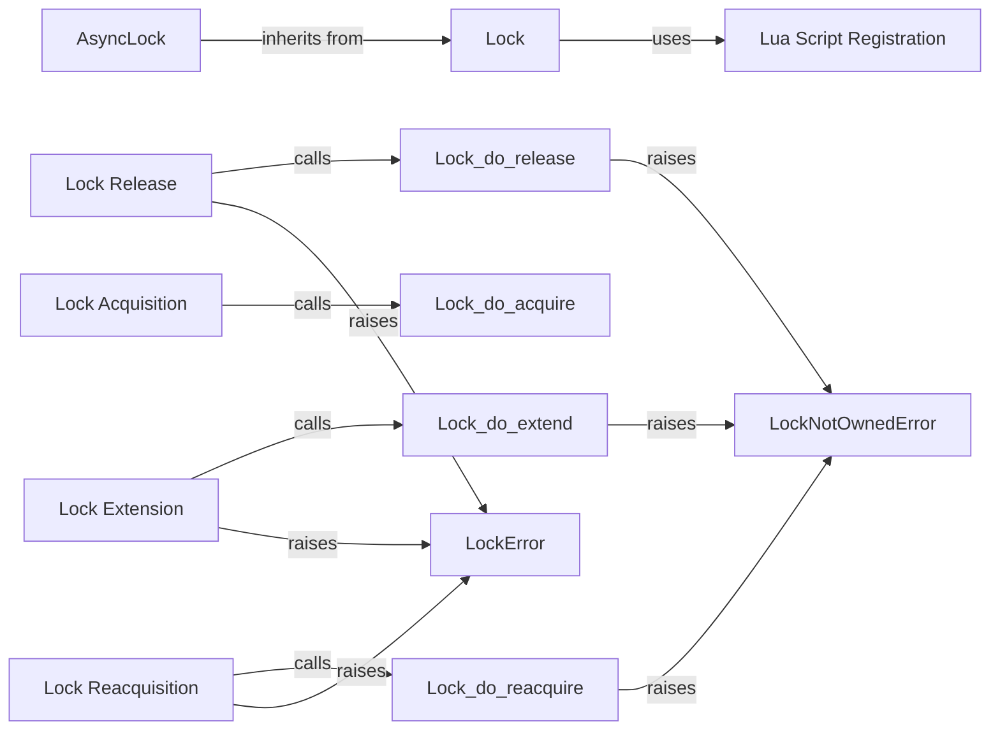

## Component Details

### Lock
The Lock class provides a mechanism for acquiring and releasing distributed locks using Redis. It ensures that only one client can hold the lock at a time, preventing race conditions and data corruption. The lock can be used as a context manager using the `with` statement, ensuring that the lock is automatically released when the block is exited. It uses Lua scripts for atomic operations.
- **Related Classes/Methods**: `redis.lock.Lock`

### AsyncLock
The AsyncLock class is an asynchronous version of the Lock class, designed for use with asyncio. It provides the same functionality as the synchronous Lock but uses asynchronous methods for interacting with Redis. This allows for non-blocking lock acquisition and release in asynchronous applications.
- **Related Classes/Methods**: `redis.asyncio.lock.Lock`

### Lock Acquisition
The lock acquisition process involves attempting to obtain the lock using the `acquire` method. This method calls an internal `do_acquire` method, which executes a Lua script on the Redis server to atomically set the lock if it is not already held. The `acquire` method can also block until the lock is acquired or a timeout is reached.
- **Related Classes/Methods**: `redis.lock.Lock:acquire`, `redis.lock.Lock.do_acquire`

### Lock Release
The lock release process involves releasing the lock using the `release` method. This method calls an internal `do_release` method, which executes a Lua script on the Redis server to atomically release the lock only if the client owns it. If the client does not own the lock, a LockNotOwnedError is raised.
- **Related Classes/Methods**: `redis.lock.Lock:release`, `redis.lock.Lock.do_release`

### Lock Extension
The lock extension process involves extending the lock's expiration time using the `extend` method. This method calls an internal `do_extend` method, which executes a Lua script on the Redis server to atomically extend the lock's expiration time only if the client owns it. If the client does not own the lock, a LockNotOwnedError is raised.
- **Related Classes/Methods**: `redis.lock.Lock:extend`, `redis.lock.Lock.do_extend`

### Lock Reacquisition
The lock reacquisition process involves reacquiring the lock if it has expired using the `reacquire` method. This method calls an internal `do_reacquire` method, which executes a Lua script on the Redis server to atomically reacquire the lock only if the client owns it. If the client does not own the lock, a LockNotOwnedError is raised.
- **Related Classes/Methods**: `redis.lock.Lock:reacquire`, `redis.lock.Lock.do_reacquire`

### LockError
The LockError exception is raised when there is an error related to the lock, such as failing to acquire the lock or an invalid operation. It serves as a base class for more specific lock-related exceptions.
- **Related Classes/Methods**: `redis.exceptions.LockError`

### LockNotOwnedError
The LockNotOwnedError exception is raised when attempting to release, extend, or reacquire a lock that is not currently owned by the client. This ensures that only the client that acquired the lock can perform these operations.
- **Related Classes/Methods**: `redis.exceptions.LockNotOwnedError`

### Lua Script Registration
The Lua Script Registration component is responsible for registering the Lua scripts used for atomic lock operations with the Redis client. This is done during the Lock object initialization using the `register_scripts` method. Registering the scripts ensures that they are available for use by the lock acquisition, release, extension, and reacquisition processes.
- **Related Classes/Methods**: `redis.lock.Lock.register_scripts`
