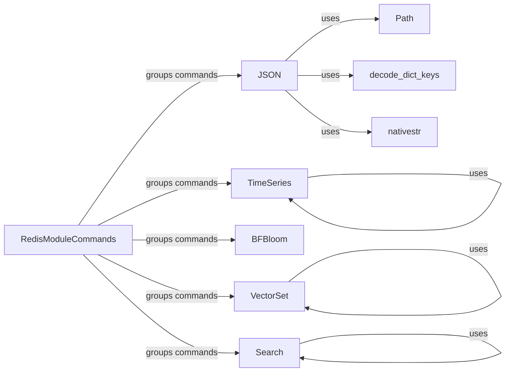

## Component Details

### RedisModuleCommands
This class serves as a central hub for all Redis module commands, providing a unified interface for interacting with various modules like JSON, Search, TimeSeries, Bloom filters, and VectorSet. It inherits from `redis.commands.core.Commands` and acts as a base class for `AsyncRedisModuleCommands`, ensuring both synchronous and asynchronous command execution.
- **Related Classes/Methods**: `redis.commands.redismodules.RedisModuleCommands`, `redis.commands.redismodules.AsyncRedisModuleCommands`

### JSON
The JSON class offers a high-level interface for interacting with the RedisJSON module. It provides methods for performing various JSON operations, such as setting, getting, deleting, and manipulating JSON documents. It leverages `JSONCommands` for the underlying command implementations and utilizes `Path` to specify locations within JSON documents.
- **Related Classes/Methods**: `redis.commands.json.JSON`, `redis.commands.json.commands.JSONCommands`, `redis.commands.json.decoders`

### TimeSeries
The TimeSeries class provides an interface for interacting with the RedisTimeSeries module. It includes methods for creating, altering, adding data to, and querying time series data. It uses `TimeSeriesCommands` for command implementations and `utils` and `info` for data handling.
- **Related Classes/Methods**: `redis.commands.timeseries.TimeSeries`, `redis.commands.timeseries.commands.TimeSeriesCommands`, `redis.commands.timeseries.utils`, `redis.commands.timeseries.info`

### BFBloom
The BFBloom class and its subclasses (CFBloom, CMSBloom, TOPKBloom, TDigestBloom) provide interfaces for interacting with the RedisBloom module, offering various Bloom filter implementations. It uses `commands` and `info` for command execution and information retrieval.
- **Related Classes/Methods**: `redis.commands.bf.BFBloom`, `redis.commands.bf.CFBloom`, `redis.commands.bf.CMSBloom`, `redis.commands.bf.TOPKBloom`, `redis.commands.bf.TDigestBloom`, `redis.commands.bf.commands`, `redis.commands.bf.info`

### VectorSet
The VectorSet class provides an interface for interacting with a VectorSet module. It includes methods for adding, querying, and manipulating vector data. It relies on `VectorSetCommands` for the actual command implementations and `utils` for data handling.
- **Related Classes/Methods**: `redis.commands.vectorset.VectorSet`, `redis.commands.vectorset.commands.VectorSetCommands`, `redis.commands.vectorset.utils`

### Search
The Search class provides an interface for interacting with the RediSearch module. It includes methods for creating indexes, adding documents, searching, and performing aggregations. It uses `SearchCommands` for command implementations and other modules like `_util`, `aggregation`, `document`, `profile_information`, `query`, and `result` for data handling and query construction.
- **Related Classes/Methods**: `redis.commands.search.Search`, `redis.commands.search.commands.SearchCommands`, `redis.commands.search._util`, `redis.commands.search.aggregation`, `redis.commands.search.document`, `redis.commands.search.profile_information`, `redis.commands.search.query`, `redis.commands.search.result`, `redis.commands.search.suggestion`

### Path
The Path class represents a path within a JSON document, used for specifying the location to perform operations on.
- **Related Classes/Methods**: `redis.commands.json.path.Path`

### decode_dict_keys
This function is responsible for decoding dictionary keys, likely converting them from bytes to strings.
- **Related Classes/Methods**: `redis.commands.json.decoders.decode_dict_keys`

### nativestr
This function converts a value to a native string (either str or unicode, depending on the Python version).
- **Related Classes/Methods**: `redis.commands.helpers.nativestr`
