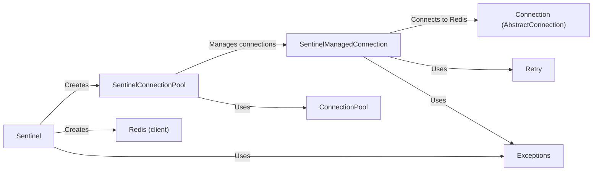

## Component Details

### Sentinel
The Sentinel class serves as the primary interface for interacting with a Redis Sentinel cluster. It's responsible for discovering the master and slave nodes within the cluster and providing Redis client instances that are connected to the appropriate nodes. It encapsulates the logic for monitoring the cluster's topology and ensuring that client connections are directed to the correct Redis instances, even in the event of a failover.
- **Related Classes/Methods**: `redis.sentinel.Sentinel`, `redis.asyncio.sentinel.Sentinel`

### SentinelConnectionPool
The SentinelConnectionPool manages a pool of connections to either the master or slave Redis instances within the Sentinel-managed cluster. It leverages the Sentinel instance to dynamically discover the addresses of these instances and maintains a pool of connections for efficient command execution. This component abstracts away the complexity of connection management in a high-availability Redis environment.
- **Related Classes/Methods**: `redis.sentinel.SentinelConnectionPool`, `redis.asyncio.sentinel.SentinelConnectionPool`

### SentinelManagedConnection
SentinelManagedConnection is a specialized connection class designed for use within the Sentinel environment. It handles the intricacies of establishing and maintaining connections to Redis instances, including connection retries and reconnection logic. This component ensures that connections are robust and resilient to network issues or Redis instance failures.
- **Related Classes/Methods**: `redis.sentinel.SentinelManagedConnection`, `redis.asyncio.sentinel.SentinelManagedConnection`

### Redis (client)
The Redis client class provides the core functionality for executing commands against Redis instances. In the context of Sentinel, the Sentinel class provides Redis client instances that are pre-configured to connect to the appropriate master or slave node. This allows applications to interact with Redis in a transparent manner, without needing to be aware of the underlying Sentinel topology.
- **Related Classes/Methods**: `redis.client.Redis`, `redis.asyncio.client.Redis`

### Connection (AbstractConnection)
AbstractConnection serves as the base class for connection implementations within the Redis client library. It defines the common interface and functionality for establishing and managing connections to Redis instances. SentinelManagedConnection inherits from this class to provide Sentinel-specific connection management logic.
- **Related Classes/Methods**: `redis.connection.AbstractConnection`, `redis.asyncio.connection.AbstractConnection`

### ConnectionPool
The ConnectionPool class provides the foundation for managing pools of connections to Redis instances. It handles connection creation, recycling, and distribution, ensuring efficient utilization of resources. SentinelConnectionPool builds upon this class to provide a connection pool that is aware of the Sentinel topology.
- **Related Classes/Methods**: `redis.connection.ConnectionPool`, `redis.asyncio.connection.ConnectionPool`

### Retry
The Retry class provides a mechanism for retrying potentially failing operations. It's used within SentinelManagedConnection to handle connection attempts and command execution that may fail due to network issues or Redis instance unavailability. This component enhances the robustness of the Sentinel integration.
- **Related Classes/Methods**: `redis.retry.Retry`

### Exceptions
The Exceptions module defines the various exceptions that can be raised by the Redis client library. These exceptions provide a standardized way to handle errors and exceptional conditions that may occur during Redis operations. Sentinel-related components may raise specific exceptions to indicate Sentinel-related issues.
- **Related Classes/Methods**: `redis.exceptions`
