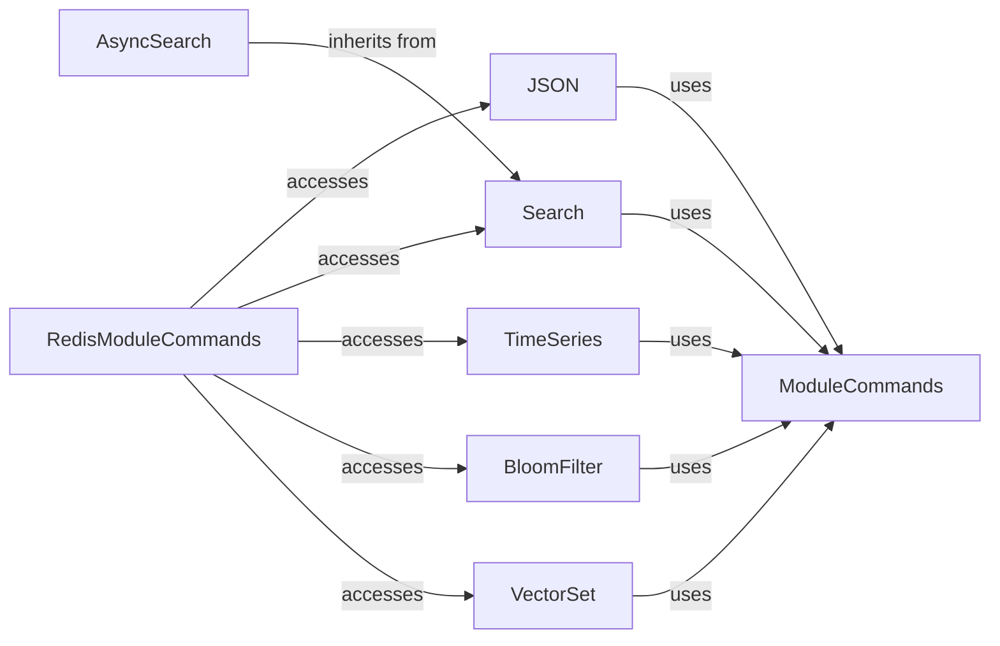

## Component Details

### RedisModuleCommands
This class acts as a central access point for Redis module commands, providing a structured way to interact with Redis modules like JSON, Search, TimeSeries, and Bloom filters. It encapsulates the instantiation and access to these modules, offering a clean namespace for module-specific operations.
- **Related Classes/Methods**: `redis.commands.redismodules.RedisModuleCommands`

### JSON
The JSON class provides an interface for interacting with the RedisJSON module. It offers methods for setting, getting, and manipulating JSON documents stored in Redis. It handles encoding and decoding of JSON data, path specification, and various JSON-specific operations like array manipulation and object key retrieval.
- **Related Classes/Methods**: `redis.commands.json.JSON`

### Search
The Search class provides an interface for interacting with the RediSearch module. It offers methods for creating indexes, adding documents, searching, aggregating, and retrieving information about the index. It supports various features like spellchecking, synonym management, and configuration.
- **Related Classes/Methods**: `redis.commands.search.Search`

### TimeSeries
The TimeSeries class provides an interface for interacting with the RedisTimeSeries module. It offers methods for creating, altering, adding data to, and querying time series data stored in Redis. It supports various operations like aggregation, filtering, and compaction rules for time series data.
- **Related Classes/Methods**: `redis.commands.timeseries.TimeSeries`

### BloomFilter
This component provides a unified interface for interacting with different Bloom filter implementations (BFBloom, CFBloom, CMSBloom, TOPKBloom, TDigestBloom) within Redis. It offers methods for creating, adding items to, checking the existence of items in, and retrieving information about Bloom filters.
- **Related Classes/Methods**: `redis.commands.bf.BFBloom`, `redis.commands.bf.CFBloom`, `redis.commands.bf.CMSBloom`, `redis.commands.bf.TOPKBloom`, `redis.commands.bf.TDigestBloom`

### VectorSet
The VectorSet class provides an interface for interacting with VectorSet commands in Redis. It offers methods for adding vectors, comparing vectors, removing elements, getting dimensions, cardinality, embeddings, links, and information about vector sets, as well as setting and getting attributes.
- **Related Classes/Methods**: `redis.commands.vectorset.VectorSet`

### AsyncSearch
The AsyncSearch class provides an asynchronous interface for interacting with the RediSearch module. It inherits from SearchCommands and offers asynchronous versions of methods for searching, aggregating, spellchecking, and retrieving information about the index.
- **Related Classes/Methods**: `redis.commands.search.Search`

### ModuleCommands
These classes (JSONCommands, TimeSeriesCommands, BFCommands, TOPKCommands, TDigestCommands, CMSCommands, VectorSetCommands) encapsulate the specific commands available for each Redis module. They provide methods for manipulating data structures and performing operations specific to each module.
- **Related Classes/Methods**: `redis.commands.json.JSON`, `redis.commands.timeseries.TimeSeries`, `redis.commands.bf.BFBloom`, `redis.commands.vectorset.VectorSet`
