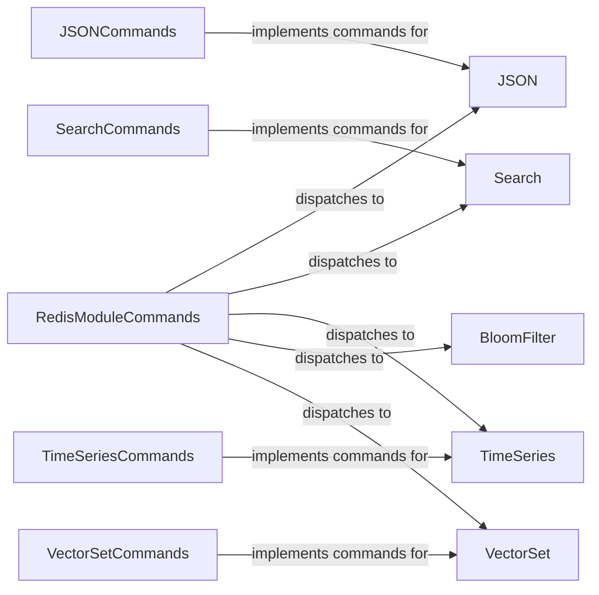

## Component Details

### RedisModuleCommands
This class serves as a central dispatcher for commands related to various Redis modules. It provides methods that return instances of classes responsible for handling specific modules like RedisJSON, RediSearch, and RedisTimeSeries, effectively acting as an entry point for module-specific operations.
- **Related Classes/Methods**: `redis.commands.redismodules.RedisModuleCommands`

### JSON
The JSON class offers a high-level interface for interacting with the RedisJSON module. It encapsulates methods for performing JSON-related operations, such as setting, getting, deleting, and manipulating JSON documents stored within Redis. It handles decoding of the data received from Redis.
- **Related Classes/Methods**: `redis.commands.json.JSON`

### JSONCommands
This class contains the concrete implementations of the JSON commands supported by the RedisJSON module. These commands include functionalities for appending to arrays, determining array lengths, popping elements from arrays, retrieving data types, and performing other JSON-specific manipulations. It uses Path to specify locations within the JSON document.
- **Related Classes/Methods**: `redis.commands.json.commands.JSONCommands`

### Search
The Search class provides an interface for interacting with the RediSearch module. It includes methods for performing search queries, aggregations, and managing indexes within Redis. It allows users to perform complex searches on data stored in Redis.
- **Related Classes/Methods**: `redis.commands.search.Search`

### SearchCommands
This class implements the commands for the RedisSearch module. It includes methods for creating indexes, adding documents, searching, aggregating, and performing other search-related operations. It uses Query to represent search queries and returns Result objects.
- **Related Classes/Methods**: `redis.commands.search.commands.SearchCommands`

### TimeSeries
The TimeSeries class provides an interface for interacting with the RedisTimeSeries module. It includes methods for creating time series, adding data points, querying ranges, and performing other time series-related operations. It enables the storage and analysis of time-based data within Redis.
- **Related Classes/Methods**: `redis.commands.timeseries.TimeSeries`

### TimeSeriesCommands
This class implements the commands for the RedisTimeSeries module. It includes methods for creating time series, adding data points, querying ranges, and performing other time series-related operations. It provides the underlying implementation for interacting with RedisTimeSeries.
- **Related Classes/Methods**: `redis.commands.timeseries.commands.TimeSeriesCommands`

### BloomFilter
The BloomFilter class (BFBloom, CFBloom, CMSBloom, TOPKBloom, TDigestBloom) provides an interface for interacting with the RedisBloom module and its various probabilistic data structures like Bloom filters, Cuckoo filters, Count-Min Sketch, TopK, and T-Digest. It enables efficient membership testing and cardinality estimation within Redis.
- **Related Classes/Methods**: `redis.commands.bf.BFBloom`, `redis.commands.bf.CFBloom`, `redis.commands.bf.CMSBloom`, `redis.commands.bf.TOPKBloom`, `redis.commands.bf.TDigestBloom`

### VectorSet
The VectorSet class provides an interface for interacting with a VectorSet data structure in Redis. It includes methods for adding vectors, performing similarity searches, and managing vector attributes. It enables efficient storage and retrieval of vectors based on similarity.
- **Related Classes/Methods**: `redis.commands.vectorset.VectorSet`

### VectorSetCommands
This class implements the commands for interacting with the VectorSet data structure. It includes methods for adding vectors, performing similarity searches, and managing vector attributes. It provides the underlying implementation for interacting with VectorSet.
- **Related Classes/Methods**: `redis.commands.vectorset.commands.VectorSetCommands`
