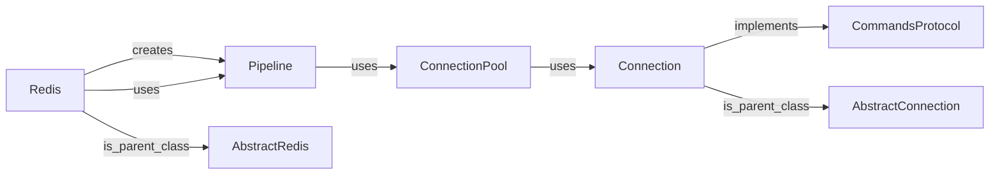

## Component Details

### Pipeline
The Pipeline class enables batching multiple commands into a single request to the Redis server, reducing network overhead and improving performance. It queues commands, serializes the request, and parses the response. It supports both synchronous and asynchronous operations, providing a way to execute a series of commands as a single atomic operation.
- **Related Classes/Methods**: `redis.client.Pipeline`, `redis.asyncio.client.Pipeline`

### Redis
The Redis class provides the main interface for interacting with a Redis server. It includes methods for connecting to the server, sending commands, and receiving responses. It uses ConnectionPool to manage connections and provides methods for executing Redis commands directly.
- **Related Classes/Methods**: `redis.client.Redis`, `redis.asyncio.client.Redis`

### ConnectionPool
The ConnectionPool class manages a pool of connections to the Redis server. It handles connection creation, reuse, and cleanup, optimizing resource utilization. It provides a way to efficiently manage multiple connections to the Redis server, reducing the overhead of creating new connections for each request.
- **Related Classes/Methods**: `redis.connection.ConnectionPool`, `redis.asyncio.connection.ConnectionPool`

### Connection
The Connection class represents a single connection to the Redis server. It handles socket communication, command serialization, and response parsing. It provides the low-level interface for sending commands to and receiving responses from the Redis server.
- **Related Classes/Methods**: `redis.connection.Connection`, `redis.asyncio.connection.Connection`

### CommandsProtocol
The CommandsProtocol defines the interface for command execution. Classes implementing this protocol provide methods for executing Redis commands and handling their responses. It ensures that all command execution classes adhere to a consistent interface.
- **Related Classes/Methods**: `redis.typing.CommandsProtocol`

### AbstractRedis
Abstract class that contains the base methods for Redis and RedisCluster. It provides common functionality and ensures consistency between different Redis client implementations.
- **Related Classes/Methods**: `redis.client.AbstractRedis`

### AbstractConnection
Abstract class that contains the base methods for Connection. It defines the basic interface for connection management and ensures that all connection implementations adhere to a consistent interface.
- **Related Classes/Methods**: `redis.connection.AbstractConnection`
