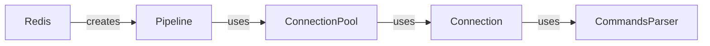

## Component Details

### Pipeline
The Pipeline component in Redis enables batching multiple commands into a single request to the Redis server, significantly reducing network round trips and improving performance. It supports both regular and transactional pipelines, allowing for efficient execution of command sequences. The pipeline object accumulates commands and sends them to the server in a single batch, then collects the responses.
- **Related Classes/Methods**: `redis.client.Pipeline`, `redis.asyncio.client.Pipeline`

### Redis
The Redis component serves as the base client class for interacting with a Redis server. It provides core functionalities such as connecting to the server, sending commands, and managing the connection lifecycle. The Redis class encapsulates the connection pool and command execution logic, offering a high-level interface for performing Redis operations.
- **Related Classes/Methods**: `redis.client.Redis`, `redis.asyncio.client.Redis`

### ConnectionPool
The ConnectionPool component manages a pool of connections to the Redis server. It handles the creation, reuse, and cleanup of connections, optimizing connection management for the Redis client. By maintaining a pool of active connections, it reduces the overhead of establishing new connections for each command, improving overall performance.
- **Related Classes/Methods**: `redis.connection.ConnectionPool`, `redis.asyncio.connection.ConnectionPool`

### Connection
The Connection component represents a single connection to the Redis server. It handles the low-level communication with the server, including sending commands and receiving responses. This component is responsible for serializing commands into the Redis protocol and parsing responses from the server.
- **Related Classes/Methods**: `redis.connection.Connection`, `redis.asyncio.connection.Connection`

### CommandsParser
The CommandsParser component is responsible for parsing the responses received from the Redis server. It converts the raw response data into Python objects that can be used by the client. This component ensures that the data returned by Redis is correctly interpreted and formatted for use in the application.
- **Related Classes/Methods**: `redis._parsers.commands.CommandsParser`, `redis._parsers.commands.AsyncCommandsParser`
