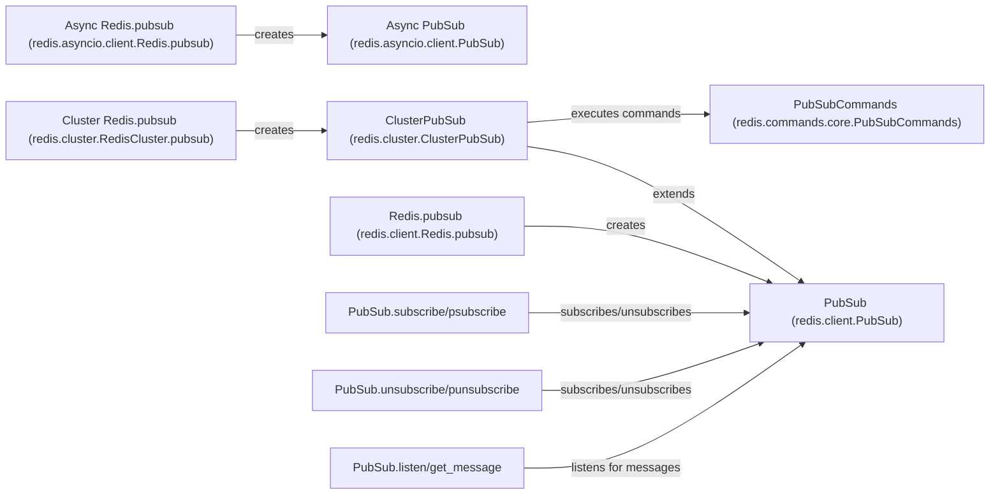

## Component Details

The PubSub Handling component in Redis provides the functionality for publish/subscribe messaging. Clients can subscribe to channels or patterns and receive messages published to those channels. The core functionality is implemented in the `PubSub` classes (both synchronous and asynchronous), which handle the connection to the Redis server, manage subscriptions, and dispatch messages. Redis clients provide factory methods to create `PubSub` instances. ClusterPubSub extends the functionality to Redis Cluster.

### PubSub (redis.client.PubSub)
The core implementation for PubSub functionality in the synchronous Redis client. It manages subscriptions to channels and patterns, listens for incoming messages, and dispatches them to registered handlers. It maintains the connection to the Redis server for PubSub operations.
- **Related Classes/Methods**: `redis-py.redis.client.PubSub`

### Async PubSub (redis.asyncio.client.PubSub)
The asynchronous version of the PubSub functionality. It provides similar functionalities like subscribing, unsubscribing, listening for messages, and handling messages in an asynchronous manner.
- **Related Classes/Methods**: `redis-py.redis.asyncio.client.PubSub`

### ClusterPubSub (redis.cluster.ClusterPubSub)
Extends the PubSub functionality to Redis Cluster. It handles the complexities of PubSub in a clustered environment, such as sharding and node management. It determines which node to send the subscribe/unsubscribe commands to and retrieves messages from the correct node.
- **Related Classes/Methods**: `redis-py.redis.cluster.ClusterPubSub`

### PubSubCommands (redis.commands.core.PubSubCommands)
Provides the implementation for pubsub related commands like `PUBLISH`, `SPUBLISH`, `PUBSUB CHANNELS`, `PUBSUB NUMPAT`, `PUBSUB NUMSUB`, `PUBSUB SHARDCHANNELS`, `PUBSUB SHARDNUMSUB`. These commands are used to publish messages, inspect the state of PubSub subscriptions, and manage sharded PubSub channels.
- **Related Classes/Methods**: `redis-py.redis.commands.core.PubSubCommands`

### Redis.pubsub (redis.client.Redis.pubsub)
A factory method that creates and returns a `PubSub` instance for the standard Redis client. It's the entry point for using PubSub with a regular Redis connection.
- **Related Classes/Methods**: `redis-py.redis.client.Redis:pubsub`

### Async Redis.pubsub (redis.asyncio.client.Redis.pubsub)
A factory method that creates and returns a `PubSub` instance for the asynchronous Redis client. It serves as the entry point for using PubSub with an asyncio Redis connection.
- **Related Classes/Methods**: `redis-py.redis.asyncio.client.Redis:pubsub`

### Cluster Redis.pubsub (redis.cluster.RedisCluster.pubsub)
A factory method that creates and returns a `ClusterPubSub` instance for the Redis Cluster client. It's the entry point for using PubSub in a Redis Cluster environment.
- **Related Classes/Methods**: `redis-py.redis.cluster.RedisCluster:pubsub`

### PubSub.subscribe/psubscribe
Methods that allow clients to subscribe to channels or patterns. Once subscribed, the client will receive messages published to those channels or matching the patterns.
- **Related Classes/Methods**: `redis-py.redis.client.PubSub:subscribe`, `redis-py.redis.asyncio.client.PubSub:subscribe`, `redis-py.redis.client.PubSub:psubscribe`, `redis-py.redis.asyncio.client.PubSub:psubscribe`

### PubSub.unsubscribe/punsubscribe
Methods that allow clients to unsubscribe from channels or patterns. After unsubscribing, the client will no longer receive messages published to those channels or matching the patterns.
- **Related Classes/Methods**: `redis-py.redis.client.PubSub:unsubscribe`, `redis-py.redis.asyncio.client.PubSub:unsubscribe`, `redis-py.redis.client.PubSub:punsubscribe`, `redis-py.redis.asyncio.client.PubSub:punsubscribe`

### PubSub.listen/get_message
Methods for receiving messages. `listen` blocks and listens for incoming messages, while `get_message` retrieves a single message without blocking.
- **Related Classes/Methods**: `redis-py.redis.client.PubSub:listen`, `redis-py.redis.asyncio.client.PubSub:listen`, `redis-py.redis.client.PubSub:get_message`, `redis-py.redis.asyncio.client.PubSub:get_message`
