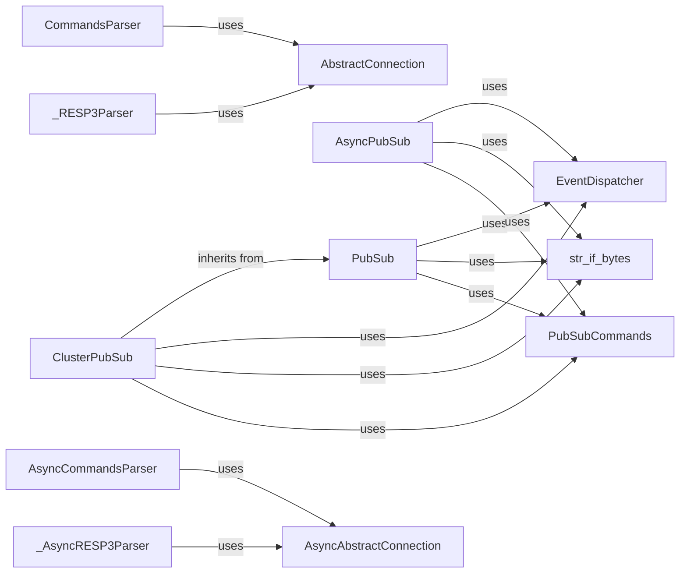

## Component Details

### PubSub
The PubSub component provides the core functionality for publishing and subscribing to channels in Redis. It manages subscriptions, handles incoming messages, and provides methods for subscribing, unsubscribing, and publishing messages. It uses the EventDispatcher for event handling and str_if_bytes for decoding messages.
- **Related Classes/Methods**: `redis.client.PubSub`

### ClusterPubSub
ClusterPubSub extends the PubSub functionality to Redis Cluster. It handles the complexities of sharded channels and ensures that subscriptions are correctly distributed across the cluster nodes. It inherits from PubSub and overrides methods to handle cluster-specific logic.
- **Related Classes/Methods**: `redis.cluster.ClusterPubSub`

### AsyncPubSub
AsyncPubSub provides an asynchronous interface for PubSub operations, enabling non-blocking communication with Redis. It's designed for use with asyncio and allows for efficient handling of PubSub messages in asynchronous applications. It uses AsyncAbstractConnection for async connections.
- **Related Classes/Methods**: `redis.asyncio.client.PubSub`

### PubSubCommands
PubSubCommands defines the set of commands available for interacting with the PubSub system. It includes methods for subscribing to channels, unsubscribing from channels, and publishing messages to channels. These commands are used by PubSub, ClusterPubSub, and AsyncPubSub.
- **Related Classes/Methods**: `redis.commands.core.PubSubCommands`

### EventDispatcher
The EventDispatcher component is responsible for dispatching events related to PubSub connections and operations. It allows applications to register listeners for specific events, such as connection established or message received, and receive notifications when those events occur. It is used by PubSub, ClusterPubSub, and AsyncPubSub.
- **Related Classes/Methods**: `redis.event.EventDispatcher`

### str_if_bytes
str_if_bytes is a utility function that converts bytes to strings if necessary. It's used in message handling to ensure that messages are in the correct format for processing. It is used by PubSub, ClusterPubSub, and AsyncPubSub.
- **Related Classes/Methods**: `redis.utils.str_if_bytes`

### AbstractConnection
AbstractConnection provides an abstract base class for managing connections to Redis. It defines the common interface for connection-related operations, such as connecting, disconnecting, and sending commands. It is used by CommandsParser and _RESP3Parser.
- **Related Classes/Methods**: `redis.connection.AbstractConnection`

### AsyncAbstractConnection
AsyncAbstractConnection provides an abstract base class for managing asynchronous connections to Redis. It defines the common interface for asynchronous connection-related operations. It is used by AsyncCommandsParser and _AsyncRESP3Parser.
- **Related Classes/Methods**: `redis.asyncio.connection.AbstractConnection`
