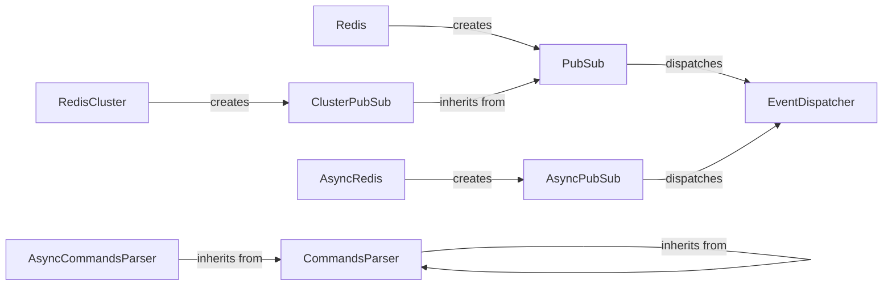

## Component Details

### PubSub
The PubSub component provides the core functionality for publishing and subscribing to channels in Redis. It manages subscriptions, listens for messages, and handles the connection to the Redis server. It provides methods to subscribe, unsubscribe, and listen for messages on specified channels or patterns.
- **Related Classes/Methods**: `redis.client.PubSub`

### AsyncPubSub
AsyncPubSub is the asynchronous version of the PubSub component, designed for use with asyncio. It provides the same functionalities as PubSub but in a non-blocking manner, allowing for efficient handling of PubSub operations in asynchronous applications. It supports asynchronous subscription, unsubscription, and message listening.
- **Related Classes/Methods**: `redis.asyncio.client.PubSub`

### Redis
The Redis client component serves as the primary interface for interacting with a Redis server. It includes methods for executing commands, managing connections, and providing access to PubSub functionality through the `pubsub` method. It encapsulates the connection details and command execution logic.
- **Related Classes/Methods**: `redis.client.Redis`

### AsyncRedis
AsyncRedis is the asynchronous version of the Redis client, built for asyncio-based applications. It offers the same functionalities as the Redis client but in a non-blocking manner. It also provides access to asynchronous PubSub operations via the `pubsub` method, enabling asynchronous message publishing and subscription.
- **Related Classes/Methods**: `redis.asyncio.client.Redis`

### ClusterPubSub
ClusterPubSub extends the PubSub functionality to support Redis Cluster deployments. It manages subscriptions across multiple nodes in the cluster, ensuring that messages are correctly routed to the appropriate subscribers. It handles the complexities of PubSub operations in a clustered environment.
- **Related Classes/Methods**: `redis.cluster.ClusterPubSub`

### RedisCluster
RedisCluster is the client component for interacting with a Redis Cluster. It extends the Redis client to support clustered Redis deployments. It includes PubSub support via the `pubsub` method, allowing applications to use PubSub functionality in a clustered Redis environment.
- **Related Classes/Methods**: `redis.cluster.RedisCluster`

### EventDispatcher
The EventDispatcher component is responsible for dispatching events related to PubSub connections and operations. It allows applications to register listeners for specific events, enabling custom event handling and integration with other parts of the system. It provides a mechanism for decoupling event generation from event handling.
- **Related Classes/Methods**: `redis.event.EventDispatcher`

### CommandsParser
The CommandsParser component is responsible for parsing commands received from the Redis server. It handles the interpretation of command responses, including those related to PubSub messages and events. It converts the raw data received from the server into a usable format for the application.
- **Related Classes/Methods**: `redis._parsers.commands.CommandsParser`

### AsyncCommandsParser
The AsyncCommandsParser component is the asynchronous version of the CommandsParser, designed for use with asyncio. It parses commands received from the Redis server in a non-blocking manner, ensuring efficient handling of command responses in asynchronous applications. It supports the parsing of PubSub-related messages and events.
- **Related Classes/Methods**: `redis._parsers.commands.AsyncCommandsParser`
