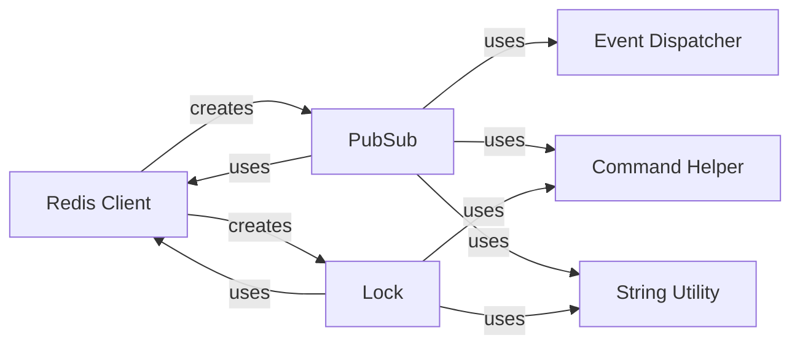

## Component Details

### Redis Client
The Redis Client provides the foundation for interacting with a Redis server. It handles connection management and command execution, serving as the base for both PubSub and Lock functionalities. It encapsulates the core logic for sending commands to Redis and receiving responses.
- **Related Classes/Methods**: `redis.client.Redis`, `redis.asyncio.client.Redis`, `redis.cluster.RedisCluster`, `redis.asyncio.cluster.RedisCluster`

### PubSub
The PubSub component enables publish-subscribe messaging with Redis. Clients can subscribe to channels and receive messages published to those channels. It builds upon the Redis Client to send subscription and publish commands, and it manages the state of subscriptions. It uses EventDispatcher for dispatching connection events.
- **Related Classes/Methods**: `redis.client.PubSub`, `redis.asyncio.client.PubSub`, `redis.cluster.ClusterPubSub`

### Lock
The Lock component implements distributed locking using Redis. It allows clients to acquire, release, extend, and reacquire locks, ensuring exclusive access to shared resources. It relies on the Redis Client for executing lock-related commands and implements logic for handling lock timeouts and retries.
- **Related Classes/Methods**: `redis.lock.Lock`, `redis.asyncio.lock.Lock`

### Event Dispatcher
The Event Dispatcher provides a mechanism for dispatching events related to pubsub connections. It allows components to react to connection events, such as after a pubsub connection is instantiated. It is used by the PubSub component to dispatch connection events.
- **Related Classes/Methods**: `redis.event.EventDispatcher`, `redis.event.AfterPubSubConnectionInstantiationEvent`

### Command Helper
The Command Helper provides utility functions for formatting commands to be sent to the Redis server. It is used by both PubSub and Lock components to construct the appropriate command strings.
- **Related Classes/Methods**: `redis.commands.helpers.list_or_args`

### String Utility
The String Utility provides helper functions for converting between bytes and strings. It is used by both PubSub and Lock components to ensure that data is in the correct format for transmission to and from the Redis server.
- **Related Classes/Methods**: `redis.utils.str_if_bytes`
