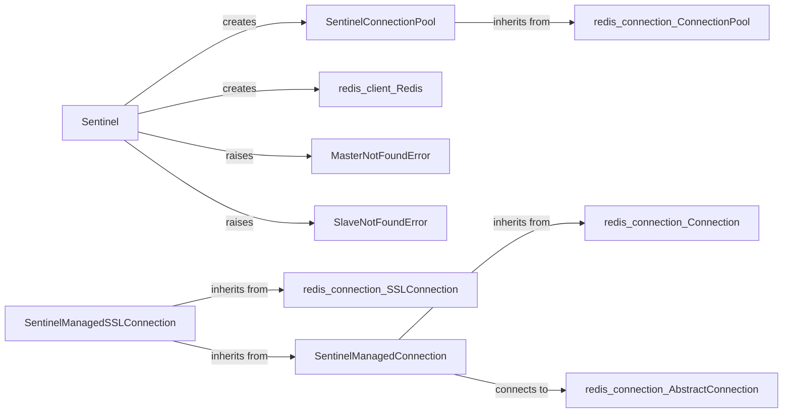

## Component Details

### Sentinel
The Sentinel class serves as the primary interface for interacting with a Redis Sentinel cluster. It enables the discovery of master and slave instances and facilitates the creation of Redis client instances connected to these servers. It abstracts the complexity of Sentinel interactions, providing a straightforward way to access Redis resources in a high-availability environment.
- **Related Classes/Methods**: `redis.sentinel.Sentinel`, `redis.asyncio.sentinel.Sentinel`

### SentinelConnectionPool
The SentinelConnectionPool is a specialized connection pool designed for Redis Sentinel. It leverages Sentinel to dynamically discover the current master and slave instances and efficiently manages connections to them. This ensures that the application always connects to the correct Redis server, even in the event of a failover.
- **Related Classes/Methods**: `redis.sentinel.SentinelConnectionPool`, `redis.asyncio.sentinel.SentinelConnectionPool`

### SentinelManagedConnection
The SentinelManagedConnection class is responsible for managing the connection to a Redis server within a Sentinel setup. It handles the intricacies of connecting, reconnecting, and reading responses from the server. The class incorporates a retry mechanism to ensure connection stability and resilience.
- **Related Classes/Methods**: `redis.sentinel.SentinelManagedConnection`, `redis.asyncio.sentinel.SentinelManagedConnection`

### SentinelManagedSSLConnection
The SentinelManagedSSLConnection class extends the SentinelManagedConnection to provide SSL connection capabilities to a Redis server within a Sentinel setup. It handles the intricacies of connecting, reconnecting, and reading responses from the server over SSL.
- **Related Classes/Methods**: `redis.sentinel.SentinelManagedSSLConnection`, `redis.asyncio.sentinel.SentinelManagedSSLConnection`

### MasterNotFoundError
The MasterNotFoundError exception is raised when the master server cannot be found within the Sentinel cluster. This exception signals a critical issue in the Sentinel setup, indicating that the application cannot locate the primary Redis instance.
- **Related Classes/Methods**: `redis.sentinel.MasterNotFoundError`, `redis.asyncio.sentinel.MasterNotFoundError`

### SlaveNotFoundError
The SlaveNotFoundError exception is raised when a slave server cannot be found within the Sentinel cluster. This exception indicates a problem in the Sentinel setup, suggesting that the application cannot locate a secondary Redis instance.
- **Related Classes/Methods**: `redis.sentinel.SlaveNotFoundError`, `redis.asyncio.sentinel.SlaveNotFoundError`
