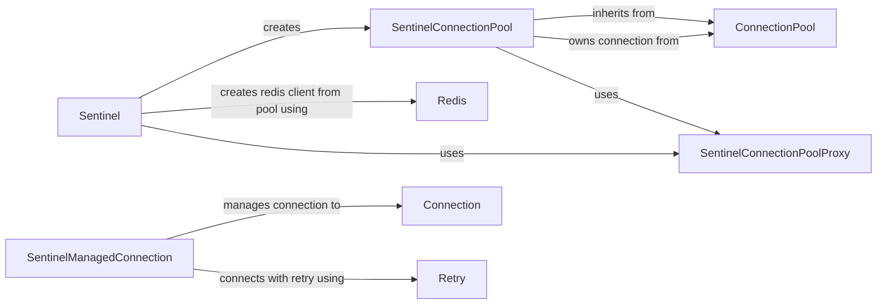

## Component Details

### Sentinel
The main entry point for interacting with a Redis Sentinel cluster. It provides methods for discovering the master and slave nodes, and for creating Redis client instances that connect to them. It handles the initial discovery of Redis nodes and provides a way to get Redis client instances connected to the master or slaves.
- **Related Classes/Methods**: `redis.sentinel.Sentinel`, `redis.asyncio.sentinel.Sentinel`

### SentinelConnectionPool
A connection pool specifically designed for use with Redis Sentinel. It manages a pool of connections to the master and slave nodes, using Sentinel to discover their addresses. It extends the base ConnectionPool to handle Sentinel-specific logic for determining the correct Redis instance to connect to.
- **Related Classes/Methods**: `redis.sentinel.SentinelConnectionPool`, `redis.asyncio.sentinel.SentinelConnectionPool`

### SentinelManagedConnection
Manages the connection to a Redis Sentinel instance. It handles connecting, reconnecting, and reading responses from the Sentinel server. This class is responsible for the low-level communication with the Sentinel server.
- **Related Classes/Methods**: `redis.sentinel.SentinelManagedConnection`, `redis.asyncio.sentinel.SentinelManagedConnection`

### Redis
The Redis client class, providing methods for interacting with a Redis server. The Sentinel class uses this to create clients connected to the master and slave nodes. It provides the standard Redis commands and functionality.
- **Related Classes/Methods**: `redis.client.Redis`, `redis.asyncio.client.Redis`

### ConnectionPool
Manages a pool of Redis connections. The SentinelConnectionPool extends this class to provide Sentinel-specific connection management. It handles the creation, management, and recycling of Redis connections.
- **Related Classes/Methods**: `redis.connection.ConnectionPool`, `redis.asyncio.connection.ConnectionPool`

### Connection
The base class for Redis connections, providing methods for connecting to and disconnecting from a Redis server, sending commands, and reading responses. It handles the socket-level communication with the Redis server.
- **Related Classes/Methods**: `redis.connection.Connection`, `redis.asyncio.connection.Connection`

### Retry
Handles retrying operations that fail due to connection errors. It provides a mechanism to automatically retry failed Redis commands.
- **Related Classes/Methods**: `redis.retry.Retry`

### SentinelConnectionPoolProxy
A proxy for a connection pool that dynamically selects the master or slave based on Sentinel's current view of the cluster. It abstracts away the complexity of managing connections to different Redis instances.
- **Related Classes/Methods**: `redis.sentinel.SentinelConnectionPoolProxy`
