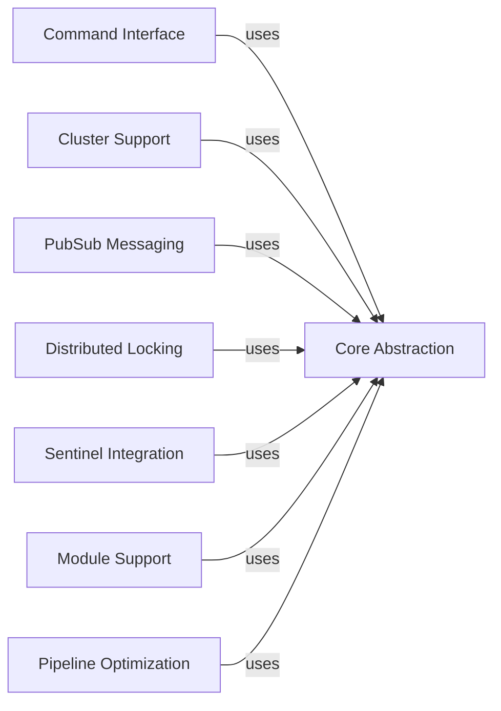

## Component Details

### Core Abstraction
The Core Abstraction component provides the fundamental building blocks for interacting with Redis. It encompasses connection management, command execution, data serialization/deserialization, and basic client functionalities. This component serves as the foundation upon which higher-level abstractions and features are built, ensuring efficient and reliable communication with the Redis server.
- **Related Classes/Methods**: `redis.client.Redis`, `redis.asyncio.client.Redis`, `redis.connection.ConnectionPool`, `redis.asyncio.connection.ConnectionPool`, `redis.connection.Connection`, `redis.asyncio.connection.Connection`, `redis.connection.AbstractConnection`, `redis.asyncio.connection.AbstractConnection`, `redis.connection.SSLConnection`, `redis.asyncio.connection.SSLConnection`, `redis.connection.UnixDomainSocketConnection`, `redis.asyncio.connection.UnixDomainSocketConnection`, `redis._parsers.encoders.Encoder`, `redis._parsers.resp2._RESP2Parser`, `redis._parsers.resp3._RESP3Parser`, `redis._parsers.hiredis._HiredisParser`, `redis._parsers.helpers`, `redis.connection.HiredisRespSerializer`, `redis.connection.PythonRespSerializer`

### Command Interface
The Command Interface component offers a high-level, user-friendly interface for executing Redis commands. It provides abstractions for various command categories, such as key management, data manipulation, and server management. This component simplifies the interaction with Redis by providing convenient methods for executing commands and handling responses, abstracting away the underlying complexities of the Redis protocol.
- **Related Classes/Methods**: `redis.commands.core.BasicKeyCommands`, `redis.commands.core.ListCommands`, `redis.commands.core.SetCommands`, `redis.commands.core.SortedSetCommands`, `redis.commands.core.HashCommands`, `redis.commands.core.StreamCommands`, `redis.commands.core.HyperlogCommands`, `redis.commands.core.GeoCommands`, `redis.commands.core.ManagementCommands`, `redis.commands.core.ACLCommands`, `redis.commands.core.ScriptCommands`, `redis.commands.core.FunctionCommands`, `redis.commands.core.ModuleCommands`

### Cluster Support
The Cluster Support component provides functionalities for interacting with Redis Cluster, a distributed implementation of Redis. It handles node discovery, slot assignment, and command routing, enabling the application to seamlessly interact with a clustered Redis environment. This component abstracts away the complexities of managing a distributed Redis deployment, providing a unified interface for data access and manipulation.
- **Related Classes/Methods**: `redis.cluster.RedisCluster`, `redis.asyncio.cluster.RedisCluster`, `redis.cluster.NodesManager`, `redis.asyncio.cluster.NodesManager`, `redis.cluster.ClusterNode`, `redis.asyncio.cluster.ClusterNode`

### PubSub Messaging
The PubSub Messaging component provides functionalities for publishing and subscribing to Redis channels, enabling real-time communication between different parts of an application. It handles message serialization, channel management, and event handling, allowing applications to easily implement publish-subscribe patterns using Redis as a message broker.
- **Related Classes/Methods**: `redis.client.PubSub`, `redis.asyncio.client.PubSub`, `redis.cluster.ClusterPubSub`

### Distributed Locking
The Distributed Locking component provides a mechanism for implementing distributed locks using Redis. It handles lock acquisition, release, and extension, ensuring that only one client can access a shared resource at a time. This component is essential for coordinating access to critical resources in a distributed environment, preventing data corruption and ensuring consistency.
- **Related Classes/Methods**: `redis.lock.Lock`, `redis.asyncio.lock.Lock`

### Sentinel Integration
The Sentinel Integration component provides functionalities for integrating with Redis Sentinel, a high-availability solution for Redis. It handles master discovery, failover, and connection management, ensuring that the application can automatically recover from Redis server failures. This component enhances the reliability and availability of Redis-based applications by providing automatic failover capabilities.
- **Related Classes/Methods**: `redis.sentinel.Sentinel`, `redis.asyncio.sentinel.Sentinel`, `redis.sentinel.SentinelConnectionPool`, `redis.asyncio.sentinel.SentinelConnectionPool`, `redis.sentinel.SentinelManagedConnection`, `redis.asyncio.sentinel.SentinelManagedConnection`

### Module Support
The Module Support component provides functionalities for interacting with Redis Modules, which extend the capabilities of Redis with custom data types and commands. It includes command builders and response parsers for various modules, such as RedisJSON, RediSearch, and RedisTimeSeries. This component allows applications to leverage the extended functionalities provided by Redis Modules, enabling them to solve a wider range of problems.
- **Related Classes/Methods**: `redis.commands.redismodules.RedisModuleCommands`, `redis.commands.json.JSON`, `redis.commands.search.Search`, `redis.commands.timeseries.TimeSeries`, `redis.commands.bf.BFBloom`, `redis.commands.vectorset.VectorSet`

### Pipeline Optimization
The Pipeline Optimization component provides functionalities for batching multiple Redis commands into a single request, reducing network round trips and improving performance. It handles command queuing, request serialization, and response parsing, allowing applications to execute multiple commands efficiently. This component is crucial for optimizing the performance of Redis-based applications, especially when executing a large number of commands.
- **Related Classes/Methods**: `redis.client.Pipeline`, `redis.asyncio.client.Pipeline`, `redis.cluster.ClusterPipeline`, `redis.commands.json.Pipeline`, `redis.commands.timeseries.Pipeline`, `redis.commands.search.Pipeline`