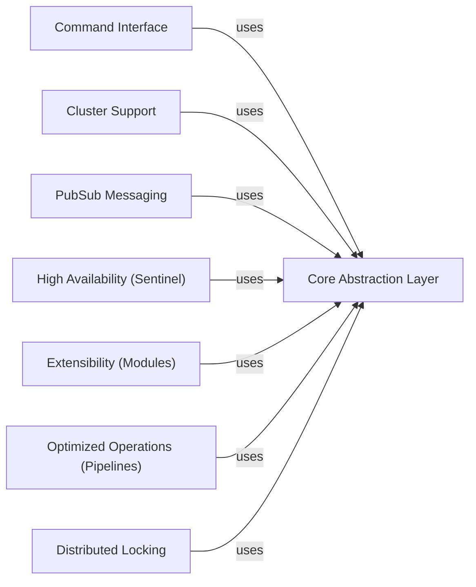

## Component Details

### Core Abstraction Layer
This component provides the fundamental building blocks for interacting with Redis. It encompasses connection management (establishing, maintaining, and pooling connections), command execution, and basic data serialization/deserialization. It offers both synchronous and asynchronous interfaces, supporting various connection types like TCP, SSL, and Unix domain sockets. It serves as the foundation upon which higher-level abstractions are built.
- **Related Classes/Methods**: `redis.client.Redis`, `redis.asyncio.client.Redis`, `redis.connection.ConnectionPool`, `redis.asyncio.connection.ConnectionPool`, `redis.connection.Connection`, `redis.asyncio.connection.Connection`, `redis.connection.AbstractConnection`, `redis.asyncio.connection.AbstractConnection`, `redis.connection.SSLConnection`, `redis.asyncio.connection.SSLConnection`, `redis.connection.UnixDomainSocketConnection`, `redis.asyncio.connection.UnixDomainSocketConnection`, `redis._parsers.encoders.Encoder`, `redis._parsers.resp2._RESP2Parser`, `redis._parsers.resp3._RESP3Parser`, `redis._parsers.hiredis._HiredisParser`, `redis._parsers.helpers`, `redis.connection.HiredisRespSerializer`, `redis.connection.PythonRespSerializer`

### Command Interface
This component offers a high-level, user-friendly interface for executing a wide range of Redis commands. It includes functionalities for key management, data manipulation (strings, lists, sets, sorted sets, hashes, streams), and server management. It relies on the Core Abstraction Layer for connection and command execution, abstracting away the low-level details of interacting with the Redis server.
- **Related Classes/Methods**: `redis.commands.core.BasicKeyCommands`, `redis.commands.core.ListCommands`, `redis.commands.core.SetCommands`, `redis.commands.core.SortedSetCommands`, `redis.commands.core.HashCommands`, `redis.commands.core.StreamCommands`, `redis.commands.core.HyperlogCommands`, `redis.commands.core.GeoCommands`, `redis.commands.core.ManagementCommands`, `redis.commands.core.ACLCommands`, `redis.commands.core.ScriptCommands`, `redis.commands.core.FunctionCommands`, `redis.commands.core.ModuleCommands`

### Cluster Support
This component provides functionalities for interacting with a Redis Cluster, a distributed implementation of Redis. It handles node discovery, slot assignment (mapping keys to specific nodes), and command routing, ensuring that commands are sent to the correct node in the cluster. It leverages the Core Abstraction Layer for basic connection and command execution, while adding cluster-specific logic for managing the distributed environment.
- **Related Classes/Methods**: `redis.cluster.RedisCluster`, `redis.asyncio.cluster.RedisCluster`, `redis.cluster.NodesManager`, `redis.asyncio.cluster.NodesManager`, `redis.cluster.ClusterNode`, `redis.asyncio.cluster.ClusterNode`

### PubSub Messaging
This component provides functionalities for publishing messages to Redis channels and subscribing to those channels to receive messages. It handles message serialization, channel management, and event handling, enabling real-time communication between applications. It depends on the Core Abstraction Layer for connection management and command execution, providing a specialized interface for pub/sub operations.
- **Related Classes/Methods**: `redis.client.PubSub`, `redis.asyncio.client.PubSub`, `redis.cluster.ClusterPubSub`

### High Availability (Sentinel)
This component provides functionalities for integrating with Redis Sentinel, a system for managing Redis instances and ensuring high availability. It handles master discovery (identifying the current master node), failover (automatically switching to a replica if the master fails), and connection management. It relies on the Core Abstraction Layer for connection management and command execution, while adding Sentinel-specific logic for monitoring and managing Redis instances.
- **Related Classes/Methods**: `redis.sentinel.Sentinel`, `redis.asyncio.sentinel.Sentinel`, `redis.sentinel.SentinelConnectionPool`, `redis.asyncio.sentinel.SentinelConnectionPool`, `redis.sentinel.SentinelManagedConnection`, `redis.asyncio.sentinel.SentinelManagedConnection`

### Extensibility (Modules)
This component provides functionalities for interacting with Redis Modules, which extend the capabilities of Redis with new data types and commands. It includes command builders and response parsers for each module, allowing applications to seamlessly use the extended functionalities. It depends on the Core Abstraction Layer for connection and command execution, while adding module-specific logic for interacting with the extended functionalities.
- **Related Classes/Methods**: `redis.commands.redismodules.RedisModuleCommands`, `redis.commands.json.JSON`, `redis.commands.search.Search`, `redis.commands.timeseries.TimeSeries`, `redis.commands.bf.BFBloom`, `redis.commands.vectorset.VectorSet`

### Optimized Operations (Pipelines)
This component provides functionalities for batching multiple Redis commands into a single request, reducing network round trips and improving performance. It handles command queuing, request serialization, and response parsing. It utilizes the Core Abstraction Layer for connection management and command execution, optimizing performance by minimizing communication overhead.
- **Related Classes/Methods**: `redis.client.Pipeline`, `redis.asyncio.client.Pipeline`, `redis.cluster.ClusterPipeline`, `redis.commands.json.Pipeline`, `redis.commands.timeseries.Pipeline`, `redis.commands.search.Pipeline`

### Distributed Locking
This component provides a distributed locking mechanism using Redis, allowing applications to coordinate access to shared resources across multiple processes or machines. It handles lock acquisition, release, and extension, ensuring that only one client can hold the lock at a time. It utilizes the Core Abstraction Layer for executing the necessary Redis commands to implement the locking logic.
- **Related Classes/Methods**: `redis.lock.Lock`, `redis.asyncio.lock.Lock`