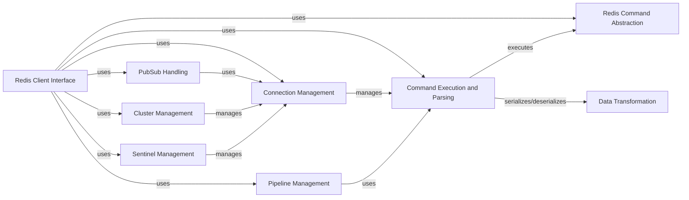

## Component Details

The redis-py library provides a Python interface to the Redis key-value store. It handles connection management, command execution, data serialization, and provides high-level abstractions for interacting with Redis features like pub/sub, transactions, and cluster mode. The library supports both synchronous and asynchronous operations, and includes features like connection pooling, retry mechanisms, and sentinel support for high availability.

### Redis Client Interface
The Redis Client Interface serves as the primary entry point for users to interact with Redis. It encapsulates connection management, command execution, and response parsing. It supports both single Redis instances and Redis Cluster, providing methods for executing commands, managing pipelines, and handling pub/sub operations. It is the entry point for most Redis operations.
- **Related Classes/Methods**: `redis.client.Redis`, `redis.asyncio.client.Redis`, `redis.cluster.RedisCluster`, `redis.asyncio.cluster.RedisCluster`

### Connection Management
The Connection Management component is responsible for establishing and maintaining connections to Redis servers. It handles connection pooling, SSL/TLS configuration, and Unix domain socket connections. It provides an abstraction for managing the underlying socket connections and ensures efficient reuse of connections. It also handles authentication.
- **Related Classes/Methods**: `redis.connection.ConnectionPool`, `redis.asyncio.connection.ConnectionPool`, `redis.connection.Connection`, `redis.asyncio.connection.Connection`, `redis.connection.SSLConnection`, `redis.asyncio.connection.SSLConnection`, `redis.connection.UnixDomainSocketConnection`, `redis.asyncio.connection.UnixDomainSocketConnection`, `redis.connection.AbstractConnection`, `redis.asyncio.connection.AbstractConnection`

### Command Execution and Parsing
The Command Execution and Parsing component is responsible for formatting Redis commands, sending them to the server, and parsing the responses. It uses different parsers based on the Redis protocol version (RESP2, RESP3, Hiredis). It also implements retry mechanisms for failed commands.
- **Related Classes/Methods**: `redis.client.Redis.execute_command`, `redis.asyncio.client.Redis.execute_command`, `redis.connection.AbstractConnection.send_command`, `redis.asyncio.connection.AbstractConnection.send_command`, `redis._parsers.base.BaseParser`, `redis._parsers.base.AsyncBaseParser`, `redis._parsers.resp2._RESP2Parser`, `redis._parsers.resp2._AsyncRESP2Parser`, `redis._parsers.resp3._RESP3Parser`, `redis._parsers.resp3._AsyncRESP3Parser`, `redis._parsers.hiredis._HiredisParser`, `redis._parsers.hiredis._AsyncHiredisParser`, `redis.retry.Retry`, `redis.asyncio.retry.Retry`

### Redis Command Abstraction
The Redis Command Abstraction component implements the various Redis commands, organized by data type and functionality (e.g., keys, strings, lists, sets, hashes). It provides a high-level API for interacting with Redis data structures. It also includes support for Redis Modules.
- **Related Classes/Methods**: `redis.commands.core.BasicKeyCommands`, `redis.commands.core.ListCommands`, `redis.commands.core.SetCommands`, `redis.commands.core.HashCommands`, `redis.commands.core.SortedSetCommands`, `redis.commands.core.StreamCommands`, `redis.commands.core.PubSubCommands`, `redis.commands.core.ScriptCommands`, `redis.commands.core.GeoCommands`, `redis.commands.core.HyperlogCommands`, `redis.commands.core.ManagementCommands`, `redis.commands.core.ACLCommands`, `redis.commands.redismodules.RedisModuleCommands`, `redis.commands.json.commands.JSONCommands`, `redis.commands.search.commands.SearchCommands`, `redis.commands.timeseries.commands.TimeSeriesCommands`, `redis.commands.vectorset.commands.VectorSetCommands`

### Pipeline Management
The Pipeline Management component allows batching multiple Redis commands into a single request, reducing network overhead and improving performance. It supports both transactional and non-transactional pipelines.
- **Related Classes/Methods**: `redis.client.Pipeline`, `redis.asyncio.client.Pipeline`, `redis.cluster.ClusterPipeline`, `redis.asyncio.cluster.ClusterPipeline`

### PubSub Handling
The PubSub Handling component provides support for Redis's publish/subscribe messaging system, allowing clients to subscribe to channels and receive messages published to those channels.
- **Related Classes/Methods**: `redis.client.PubSub`, `redis.asyncio.client.PubSub`, `redis.cluster.ClusterPubSub`

### Cluster Management
The Cluster Management component handles the complexities of interacting with a Redis Cluster, including node discovery, slot assignment, and command routing. It ensures that commands are sent to the correct node in the cluster.
- **Related Classes/Methods**: `redis.cluster.RedisCluster`, `redis.asyncio.cluster.RedisCluster`, `redis.cluster.NodesManager`, `redis.asyncio.cluster.NodesManager`, `redis.cluster.ClusterNode`, `redis.asyncio.cluster.ClusterNode`

### Sentinel Management
The Sentinel Management component provides support for Redis Sentinel, a monitoring and failover system for Redis. It allows clients to automatically discover the current master server and handle failover events.
- **Related Classes/Methods**: `redis.sentinel.Sentinel`, `redis.asyncio.sentinel.Sentinel`, `redis.sentinel.SentinelConnectionPool`, `redis.asyncio.sentinel.SentinelConnectionPool`, `redis.sentinel.SentinelManagedConnection`, `redis.asyncio.sentinel.SentinelManagedConnection`

### Data Transformation
The Data Transformation component handles the serialization of Python objects into a format that can be stored in Redis, and the deserialization of Redis data back into Python objects. Encoders are used to convert data to bytes before sending to Redis.
- **Related Classes/Methods**: `redis._parsers.encoders.Encoder`