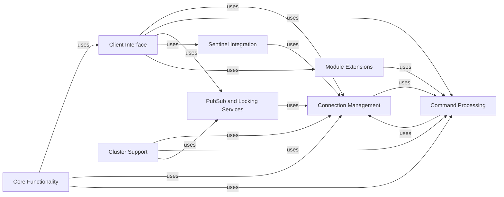

## Component Details

### Core Functionality
This component encompasses the fundamental Redis commands and data structure operations. It provides the building blocks for interacting with Redis, including key management, data manipulation, and server configuration. It serves as the foundation upon which higher-level functionalities are built.
- **Related Classes/Methods**: `redis.commands.core.CoreCommands`, `redis.commands.core.BasicKeyCommands`, `redis.commands.core.ListCommands`, `redis.commands.core.SetCommands`, `redis.commands.core.SortedSetCommands`, `redis.commands.core.HashCommands`, `redis.commands.core.StreamCommands`, `redis.commands.core.PubSubCommands`, `redis.commands.core.ScriptCommands`, `redis.commands.core.GeoCommands`, `redis.commands.core.ManagementCommands`, `redis.commands.core.ACLCommands`

### Client Interface
This component provides the primary interface for interacting with Redis. It offers methods for executing commands, managing connections, and configuring client-specific settings. It supports both synchronous and asynchronous operations, providing a versatile way to access Redis functionalities and acts as the entry point for most user interactions.
- **Related Classes/Methods**: `redis.client.Redis`, `redis.asyncio.client.Redis`, `redis.client.AbstractRedis`

### Connection Management
This component is responsible for establishing, maintaining, and pooling connections to the Redis server. It supports various connection types, including TCP, Unix domain sockets, and SSL connections. It also provides mechanisms for connection pooling and error handling, ensuring reliable and efficient communication with Redis.
- **Related Classes/Methods**: `redis.connection.ConnectionPool`, `redis.asyncio.connection.ConnectionPool`, `redis.connection.Connection`, `redis.asyncio.connection.Connection`, `redis.connection.AbstractConnection`, `redis.asyncio.connection.AbstractConnection`

### Cluster Support
This component provides functionalities for interacting with Redis Cluster, including node discovery, command routing, and cluster topology management. It supports both synchronous and asynchronous cluster operations, enabling scalable and highly available Redis deployments. It abstracts the complexities of interacting with a clustered Redis environment.
- **Related Classes/Methods**: `redis.cluster.RedisCluster`, `redis.asyncio.cluster.RedisCluster`, `redis.cluster.NodesManager`, `redis.asyncio.cluster.NodesManager`, `redis.cluster.ClusterNode`, `redis.asyncio.cluster.ClusterNode`

### Command Processing
This component handles the processing of Redis commands, including parsing, pipelining, and retrying. It optimizes command execution and ensures reliable delivery, enhancing the overall performance and stability of Redis interactions. It abstracts away the low-level details of command handling.
- **Related Classes/Methods**: `redis.client.Pipeline`, `redis.asyncio.client.Pipeline`, `redis.cluster.ClusterPipeline`, `redis.asyncio.cluster.ClusterPipeline`, `redis._parsers.commands.CommandsParser`, `redis._parsers.commands.AsyncCommandsParser`, `redis._parsers.resp2._RESP2Parser`, `redis._parsers.resp3._RESP3Parser`, `redis._parsers.hiredis._HiredisParser`, `redis.retry.Retry`, `redis.asyncio.retry.Retry`, `redis.backoff.AbstractBackoff`

### PubSub and Locking Services
This component provides functionalities for publish-subscribe messaging and distributed locking. It enables real-time communication between clients and coordinated access to shared resources, supporting advanced application patterns. It offers essential building blocks for building distributed systems with Redis.
- **Related Classes/Methods**: `redis.client.PubSub`, `redis.asyncio.client.PubSub`, `redis.cluster.ClusterPubSub`, `redis.lock.Lock`, `redis.asyncio.lock.Lock`

### Sentinel Integration
This component provides functionalities for integrating with Redis Sentinel, a monitoring and failover system for Redis. It allows clients to automatically discover and connect to the master server, even in the event of a failover, ensuring high availability. It simplifies the integration with Redis Sentinel for robust deployments.
- **Related Classes/Methods**: `redis.sentinel.Sentinel`, `redis.asyncio.sentinel.Sentinel`, `redis.sentinel.SentinelConnectionPool`, `redis.asyncio.sentinel.SentinelConnectionPool`, `redis.sentinel.SentinelManagedConnection`, `redis.asyncio.sentinel.SentinelManagedConnection`

### Module Extensions
This component provides support for Redis Modules, extending the functionality of Redis with custom data types and commands. It includes specific modules like JSON, Search, TimeSeries, and VectorSet, enabling specialized use cases. It allows users to leverage the power of Redis Modules within the redis-py client.
- **Related Classes/Methods**: `redis.commands.redismodules.RedisModuleCommands`, `redis.commands.json.JSON`, `redis.commands.search.Search`, `redis.commands.timeseries.TimeSeries`, `redis.commands.vectorset.VectorSet`