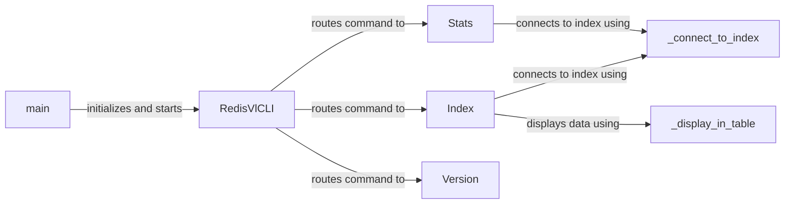

## Component Details

The CLI Tooling component provides a command-line interface for interacting with RedisVL. It allows users to manage Redis vector indexes through commands for creating, inspecting, and deleting indexes, as well as viewing statistics and version information. The CLI uses the `typer` library to define the command-line interface and handles the overall control flow. The entry point for the CLI application initializes the `RedisVlCLI` class and starts the command-line interface.

### RedisVlCLI
The main class for the CLI, responsible for parsing commands and routing them to the appropriate handlers. It uses the `typer` library to define the command-line interface and handles the overall control flow.
- **Related Classes/Methods**: `redisvl.cli.main.RedisVlCLI`

### Index
Handles index-related commands such as create, info, listall, delete, and destroy. It interacts with the Redis database to perform these operations and uses helper functions to connect to the index and display data.
- **Related Classes/Methods**: `redisvl.cli.index.Index`

### Stats
Handles commands related to index statistics. It retrieves statistics from the Redis database and presents them to the user.
- **Related Classes/Methods**: `redisvl.cli.stats.Stats`

### Version
Handles the version command, displaying the current version of the RedisVL library.
- **Related Classes/Methods**: `redisvl.cli.version.Version`

### _connect_to_index
A helper function used by Index and Stats to establish a connection to a Redis index. It encapsulates the logic for connecting to the Redis database and retrieving the index.
- **Related Classes/Methods**: `redisvl.cli.index.Index:_connect_to_index`, `redisvl.cli.stats.Stats:_connect_to_index`

### _display_in_table
A helper function to display data in a table format. It formats the data and presents it in a user-friendly table.
- **Related Classes/Methods**: `redisvl.cli.index:_display_in_table`

### main
The entry point for the CLI application. It initializes the `RedisVlCLI` class and starts the command-line interface.
- **Related Classes/Methods**: `redisvl.cli.runner.main`
