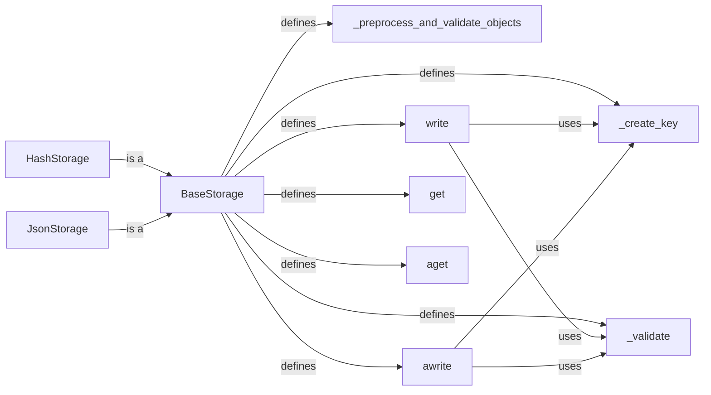

## Component Details

The Data Handling component in redisvl manages the storage and retrieval of data within a Redis index. It provides an abstraction layer over Redis, allowing users to interact with the database without needing to know the underlying data structures. The component supports storing data as either hashes or JSON objects, providing flexibility for different use cases. The main flow involves writing data to Redis (either synchronously or asynchronously), retrieving data by ID, and validating data before storage. The purpose of this component is to provide a consistent and efficient interface for data access in redisvl.

### BaseStorage
Abstract base class defining the interface for interacting with Redis storage. It provides methods for writing, reading, validating, and preprocessing data. It encapsulates common logic and ensures consistency across different storage implementations. It defines abstract methods for writing, reading, and validating data, which are then implemented by concrete storage classes.
- **Related Classes/Methods**: `redisvl.index.storage.BaseStorage`

### _create_key
A method within BaseStorage responsible for generating unique keys for storing data in Redis. This ensures proper organization and retrieval of data within the database. The key is created using the index name and the document ID.
- **Related Classes/Methods**: `redisvl.index.storage.BaseStorage:_create_key`

### _validate
A method within BaseStorage that validates the input data before writing it to Redis. This ensures data integrity and prevents errors caused by invalid or malformed data. It checks if the input data is a dictionary.
- **Related Classes/Methods**: `redisvl.index.storage.BaseStorage:_validate`

### _preprocess_and_validate_objects
A method within BaseStorage that preprocesses and validates objects before writing them to Redis. This may involve data transformation, normalization, or other operations to ensure data is in the correct format for storage and retrieval. It iterates through the objects and validates each one.
- **Related Classes/Methods**: `redisvl.index.storage.BaseStorage:_preprocess_and_validate_objects`

### write
A method within BaseStorage that writes data to Redis synchronously. This is the primary method for storing data in the database. It calls _create_key to generate the key and _validate to validate the data before writing to Redis.
- **Related Classes/Methods**: `redisvl.index.storage.BaseStorage:write`

### awrite
A method within BaseStorage that writes data to Redis asynchronously. This allows for non-blocking operations and improved performance when writing large amounts of data. It calls _create_key to generate the key and _validate to validate the data before writing to Redis.
- **Related Classes/Methods**: `redisvl.index.storage.BaseStorage:awrite`

### get
A method within BaseStorage that retrieves data from Redis synchronously. This is the primary method for reading data from the database. It retrieves data from Redis using the key generated by _create_key.
- **Related Classes/Methods**: `redisvl.index.storage.BaseStorage:get`

### aget
A method within BaseStorage that retrieves data from Redis asynchronously. This allows for non-blocking operations and improved performance when reading data. It retrieves data from Redis using the key generated by _create_key.
- **Related Classes/Methods**: `redisvl.index.storage.BaseStorage:aget`

### HashStorage
A concrete implementation of BaseStorage that stores data in Redis as hashes. It inherits from BaseStorage and implements the abstract methods for writing and reading data as hashes.
- **Related Classes/Methods**: `redisvl.index.storage.HashStorage`

### JsonStorage
A concrete implementation of BaseStorage that stores data in Redis as JSON objects. It inherits from BaseStorage and implements the abstract methods for writing and reading data as JSON objects.
- **Related Classes/Methods**: `redisvl.index.storage.JsonStorage`
