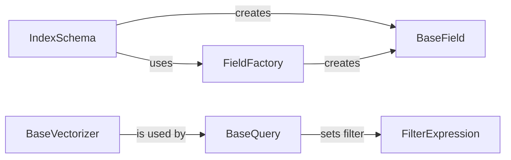

## Component Details

### IndexSchema
The IndexSchema component defines the structure and configuration of a Redis search index. It manages index settings, field definitions (including vector and metadata fields), and schema validation. It supports loading schemas from YAML files or dictionaries, converting the schema to a dictionary or YAML format, and interacting with FieldFactory to create field objects. The IndexSchema ensures that the index is properly configured before data is ingested.
- **Related Classes/Methods**: `redisvl.schema.schema.IndexSchema`

### FieldFactory
The FieldFactory component is a factory class responsible for creating field objects (e.g., Text, Tag, Numeric, Geo, Vector) based on the provided type and attributes. It encapsulates the logic for instantiating the appropriate field class, simplifying the process of defining fields within the IndexSchema. It is used by IndexSchema to create fields.
- **Related Classes/Methods**: `redisvl.schema.fields.FieldFactory`

### BaseField
The BaseField component serves as the base class for all field types (e.g., Text, Tag, Numeric, Geo, Vector). It defines common attributes like name, type, and path, providing a common interface for all field types. Specific field types inherit from BaseField, extending its functionality with type-specific attributes and methods.
- **Related Classes/Methods**: `redisvl.schema.fields.BaseField`

### FilterExpression
The FilterExpression component represents a logical combination of filters used in Redis queries. It allows combining individual filters (e.g., Tag, Num, Text, Geo) using logical operators like AND and OR to create complex filter expressions. These expressions are then used to refine search results based on specific criteria. It uses the FilterField to create the filter expression.
- **Related Classes/Methods**: `redisvl.query.filter.FilterExpression`

### BaseQuery
The BaseQuery component serves as the base class for all query types (e.g., VectorQuery, TextQuery). It provides common functionality for setting filters, building query strings, and managing query parameters. Specific query types inherit from BaseQuery, extending its functionality with type-specific attributes and methods. It uses FilterExpression to set filters.
- **Related Classes/Methods**: `redisvl.query.query.BaseQuery`

### BaseVectorizer
The BaseVectorizer component is an abstract class that defines the interface for converting text to vector embeddings. It includes methods for embedding single and multiple texts, as well as asynchronous versions. It also handles caching of embeddings to improve performance. It is used by VectorQuery and VectorRangeQuery to vectorize the query.
- **Related Classes/Methods**: `redisvl.utils.vectorize.base.BaseVectorizer`
