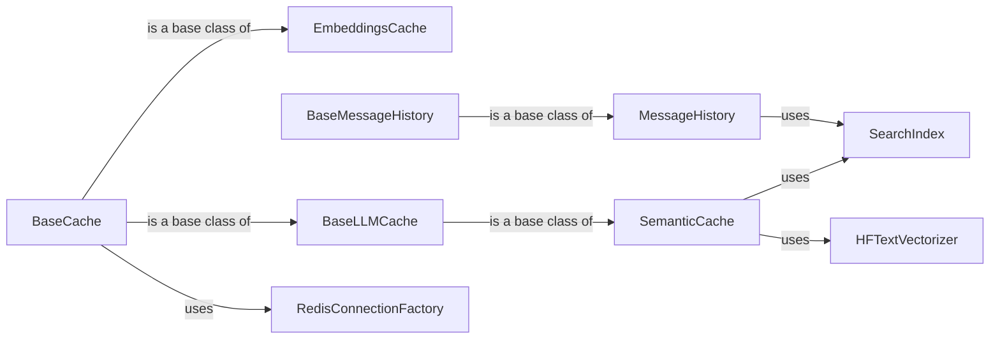

## Component Details

### BaseCache
Abstract base class for implementing cache extensions, providing common functionalities like Redis client management, key generation, and TTL handling. It handles connection and disconnection to Redis and defines the basic interface for cache operations.
- **Related Classes/Methods**: `redisvl.extensions.cache.base.BaseCache`

### EmbeddingsCache
Extends BaseCache to provide caching functionality specifically for embeddings, including methods for storing, retrieving, and managing embeddings in Redis. It provides methods for checking existence, getting, setting, and dropping embeddings based on text and model name, optimizing embedding retrieval.
- **Related Classes/Methods**: `redisvl.extensions.cache.embeddings.embeddings.EmbeddingsCache`

### SemanticCache
Extends BaseLLMCache to implement a semantic cache for LLM responses, using vector embeddings and semantic similarity search to determine cache hits. It interacts with a vectorizer to create embeddings and uses Redis indexes for semantic search, enhancing LLM response efficiency.
- **Related Classes/Methods**: `redisvl.extensions.cache.llm.semantic.SemanticCache`

### BaseLLMCache
Abstract base class for LLM cache extensions, inheriting from BaseCache and providing common functionalities for LLM caching. It provides methods for storing, checking, deleting, and updating cache entries, forming the foundation for LLM-specific caching strategies.
- **Related Classes/Methods**: `redisvl.extensions.cache.llm.base.BaseLLMCache`

### MessageHistory
Extension for managing message history in Redis, using a Redis index to store and retrieve messages based on various criteria. It provides methods for adding, retrieving, clearing, and deleting messages, enabling conversational context management.
- **Related Classes/Methods**: `redisvl.extensions.message_history.message_history.MessageHistory`

### BaseMessageHistory
Abstract base class for message history extensions, providing common functionalities for managing message history. It provides methods for adding messages, retrieving recent messages, clearing history, and deleting the history, defining the structure for message history implementations.
- **Related Classes/Methods**: `redisvl.extensions.message_history.base_history.BaseMessageHistory`

### SearchIndex
Class used to interact with Redis as a vector database. It provides methods for creating, deleting, loading data, querying, and searching the index, serving as the primary interface for vector-based operations.
- **Related Classes/Methods**: `redisvl.index.index.SearchIndex`

### RedisConnectionFactory
Factory class for creating Redis connections, both synchronous and asynchronous. It handles the creation and validation of Redis connections, ensuring reliable Redis access.
- **Related Classes/Methods**: `redisvl.redis.connection.RedisConnectionFactory`

### HFTextVectorizer
Text vectorizer using Hugging Face transformers. It provides methods for embedding text using Hugging Face models, enabling semantic search capabilities.
- **Related Classes/Methods**: `redisvl.utils.vectorize.text.huggingface.HFTextVectorizer`
