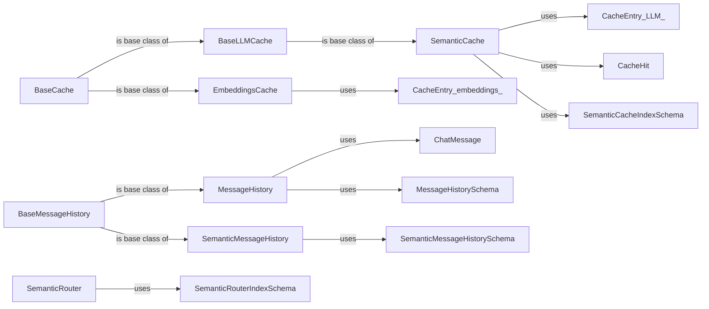

## Component Details

The Extension Framework provides a suite of tools to enhance LLM applications with Redis. It includes caching mechanisms for both embeddings and LLM responses, semantic routing for directing queries to appropriate indexes, and message history management for tracking conversations. These extensions leverage Redis's vector similarity search capabilities to improve performance and efficiency.

### BaseCache
The BaseCache class serves as an abstract foundation for implementing various caching strategies within the RedisVL extension framework. It offers core functionalities such as key generation, Redis client management, and expiration control, providing a consistent interface for derived cache implementations like EmbeddingsCache and SemanticCache.
- **Related Classes/Methods**: `redisvl.extensions.cache.base.BaseCache`

### EmbeddingsCache
The EmbeddingsCache extends the BaseCache to provide a specialized cache for storing and retrieving embeddings. It offers methods for storing embeddings, retrieving them based on keys, checking for their existence, and removing them when necessary. This cache is crucial for optimizing embedding retrieval in LLM applications.
- **Related Classes/Methods**: `redisvl.extensions.cache.embeddings.embeddings.EmbeddingsCache`, `redisvl.extensions.cache.embeddings.schema.CacheEntry`

### SemanticCache
The SemanticCache extends the BaseLLMCache and implements a cache for LLM responses using semantic similarity. It stores embeddings of LLM inputs in a Redis index and uses vector similarity search to retrieve cached responses for semantically similar queries. This cache significantly reduces LLM computation by reusing previous results.
- **Related Classes/Methods**: `redisvl.extensions.cache.llm.semantic.SemanticCache`, `redisvl.extensions.cache.llm.schema.CacheEntry`, `redisvl.extensions.cache.llm.schema.CacheHit`, `redisvl.extensions.cache.llm.schema.SemanticCacheIndexSchema`

### BaseLLMCache
The BaseLLMCache class is an abstract base class for LLM caches, providing common functionalities and structure for specialized LLM cache implementations like SemanticCache. It likely builds upon BaseCache to add LLM-specific caching logic.
- **Related Classes/Methods**: `redisvl.extensions.cache.llm.base.BaseLLMCache`

### MessageHistory
The MessageHistory class manages the history of messages in a conversation. It provides methods for storing new messages, retrieving existing messages, and deleting messages when necessary. This component is essential for maintaining context in conversational AI applications.
- **Related Classes/Methods**: `redisvl.extensions.message_history.message_history.MessageHistory`, `redisvl.extensions.message_history.schema.ChatMessage`, `redisvl.extensions.message_history.schema.MessageHistorySchema`

### BaseMessageHistory
The BaseMessageHistory class serves as an abstract base for message history implementations. It provides a common interface for different message history strategies, such as storing messages in a simple list or using semantic similarity for retrieval.
- **Related Classes/Methods**: `redisvl.extensions.message_history.base_history.BaseMessageHistory`

### SemanticMessageHistory
The SemanticMessageHistory extends BaseMessageHistory and implements a message history that uses semantic similarity to retrieve relevant messages. It stores embeddings of messages and uses vector search to find messages that are semantically similar to a given query. This allows for more context-aware conversation management.
- **Related Classes/Methods**: `redisvl.extensions.message_history.semantic_history.SemanticMessageHistory`, `redisvl.extensions.message_history.schema.SemanticMessageHistorySchema`

### SemanticRouter
The SemanticRouter class routes requests based on semantic similarity to predefined routes. It uses a Redis index to store route embeddings and classifies incoming requests by finding the most similar route. This allows for dynamic routing of queries to the appropriate resources.
- **Related Classes/Methods**: `redisvl.extensions.router.semantic.SemanticRouter`, `redisvl.extensions.router.schema.SemanticRouterIndexSchema`, `redisvl.extensions.router.schema.Route`
