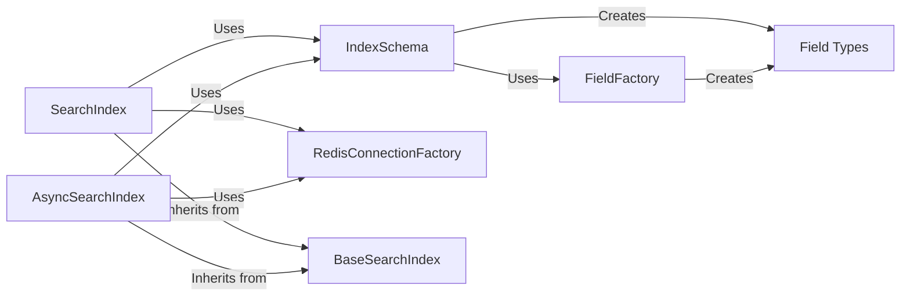

## Component Details

The Index Management component provides a high-level interface for creating, deleting, and managing vector indexes within Redis. It abstracts away the underlying Redis commands and data structures, offering a simplified way to define index schemas, connect to Redis, and perform index-related operations. The main flow involves defining an index schema using Field types, creating a connection to Redis using RedisConnectionFactory, and then using SearchIndex or AsyncSearchIndex to create, manage, and query the index.

### SearchIndex
The SearchIndex class serves as the primary interface for interacting with a Redis index in a synchronous manner. It encapsulates functionalities for index creation, deletion, data loading, querying, and management. It relies on RedisConnectionFactory to establish and manage the connection to the Redis server and utilizes IndexSchema to define the structure and properties of the index.
- **Related Classes/Methods**: `redisvl.index.index.SearchIndex`

### AsyncSearchIndex
The AsyncSearchIndex class provides an asynchronous interface for interacting with a Redis index. Mirroring the functionalities of SearchIndex, it leverages asynchronous operations to enhance performance. It also depends on RedisConnectionFactory for connection management and IndexSchema for index definition.
- **Related Classes/Methods**: `redisvl.index.index.AsyncSearchIndex`

### IndexSchema
The IndexSchema class is responsible for defining the schema of the Redis index, including the fields and their respective types. It offers methods for adding fields, validating the schema's integrity, and generating the Redis index definition. It utilizes FieldFactory to create the individual field objects that constitute the schema.
- **Related Classes/Methods**: `redisvl.schema.schema.IndexSchema`

### RedisConnectionFactory
The RedisConnectionFactory class manages the connection to the Redis server, providing methods for creating both synchronous and asynchronous Redis clients. It also offers functionalities for retrieving information about the Redis modules installed on the server, ensuring compatibility and proper operation.
- **Related Classes/Methods**: `redisvl.redis.connection.RedisConnectionFactory`

### BaseSearchIndex
The BaseSearchIndex class serves as the foundation for both SearchIndex and AsyncSearchIndex, providing common functionalities such as connecting to Redis, deleting indexes, and other shared operations. It encapsulates the core logic that is shared between the synchronous and asynchronous index implementations.
- **Related Classes/Methods**: `redisvl.index.index.BaseSearchIndex`

### Field Types
These classes (TextField, TagField, NumericField, GeoField, FlatVectorField, HNSWVectorField) represent the different field types supported by the Redis index. Each class provides a method for converting the field definition into the format required by Redis. They are created by the FieldFactory and used by the IndexSchema to define the index structure.
- **Related Classes/Methods**: `redisvl.schema.fields.TextField`, `redisvl.schema.fields.TagField`, `redisvl.schema.fields.NumericField`, `redisvl.schema.fields.GeoField`, `redisvl.schema.fields.FlatVectorField`, `redisvl.schema.fields.HNSWVectorField`

### FieldFactory
The FieldFactory class is responsible for creating field objects based on the specified field type. It encapsulates the logic for instantiating the appropriate field class based on the provided configuration, ensuring that the correct field type is created based on the provided specifications.
- **Related Classes/Methods**: `redisvl.schema.fields.FieldFactory`
