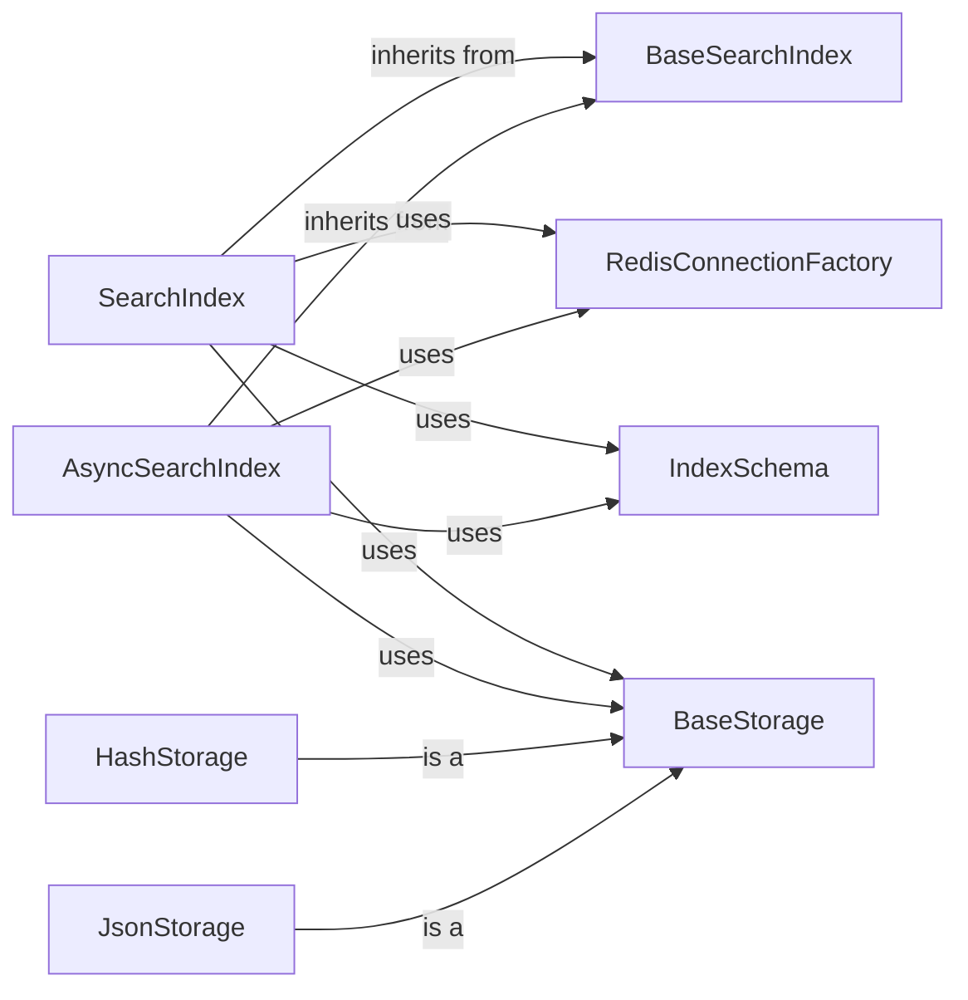

## Component Details

### SearchIndex
The SearchIndex class provides a synchronous interface for interacting with a Redis search index. It handles index creation, deletion, querying, and data management. It utilizes RedisConnectionFactory for connection management, IndexSchema for schema definition, and BaseStorage for data storage. It also uses functions like process_results and process_aggregate_results to handle query results.
- **Related Classes/Methods**: `repos.redis-vl-python.redisvl.index.index.SearchIndex`

### AsyncSearchIndex
The AsyncSearchIndex class provides an asynchronous interface for interacting with a Redis search index, enabling non-blocking operations. It inherits from BaseSearchIndex and uses asynchronous Redis clients. It uses RedisConnectionFactory to manage connections, IndexSchema to define the index schema, and BaseStorage for data storage. It also uses functions like process_results and process_aggregate_results to handle query results.
- **Related Classes/Methods**: `repos.redis-vl-python.redisvl.index.index.AsyncSearchIndex`

### BaseSearchIndex
The BaseSearchIndex class serves as the foundation for both synchronous and asynchronous search index implementations. It provides common functionalities such as loading index definitions from YAML or dictionaries, validating queries, and managing keys. It encapsulates shared logic and attributes used by its subclasses.
- **Related Classes/Methods**: `repos.redis-vl-python.redisvl.index.index.BaseSearchIndex`

### RedisConnectionFactory
The RedisConnectionFactory class is responsible for managing both synchronous and asynchronous Redis connections. It provides methods for retrieving connections, validating Redis modules, and handling connection details, ensuring efficient and reliable communication with the Redis server.
- **Related Classes/Methods**: `redisvl.redis.connection.RedisConnectionFactory`

### IndexSchema
The IndexSchema class defines the schema for a Redis index, including fields, vectors, and other index properties. It provides methods for creating and validating schemas from dictionaries or YAML files, ensuring that the index structure is well-defined and consistent.
- **Related Classes/Methods**: `redisvl.schema.schema.IndexSchema`

### BaseStorage
The BaseStorage class serves as an abstract base class for managing data storage in Redis. It provides methods for writing, reading, validating, and preprocessing data, interacting with Redis to store and retrieve data based on the defined schema. Concrete implementations like HashStorage and JsonStorage inherit from this class.
- **Related Classes/Methods**: `repos.redis-vl-python.redisvl.index.storage.BaseStorage`

### HashStorage
The HashStorage class is a concrete implementation of BaseStorage that stores data as Redis hashes. It provides methods for writing, reading, validating, and preprocessing data, interacting with Redis to store and retrieve data as hashes based on the defined schema.
- **Related Classes/Methods**: `redisvl.index.storage.HashStorage`

### JsonStorage
The JsonStorage class is a concrete implementation of BaseStorage that stores data as JSON strings in Redis. It provides methods for writing, reading, validating, and preprocessing data, interacting with Redis to store and retrieve data as JSON strings based on the defined schema.
- **Related Classes/Methods**: `redisvl.index.storage.JsonStorage`
