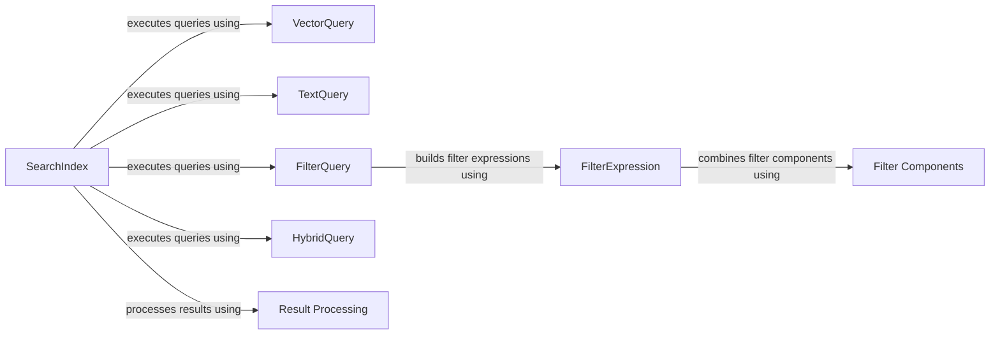

## Component Details

The Query Processing component is responsible for constructing and executing queries against a Redis index. It supports various query types, including vector similarity searches, text searches, and filtered queries. It provides mechanisms for combining different query types and processing the results, enabling complex search scenarios. The main flow involves creating query objects (VectorQuery, TextQuery, FilterQuery, HybridQuery), combining them as needed, and then executing them via the SearchIndex. The results are then processed and returned to the user.

### SearchIndex
The SearchIndex class provides the primary interface for performing searches and aggregations on a Redis index. It handles query construction, validation, execution, and result processing. It interacts with the query objects to execute the search and with the result processing functions to format the output.
- **Related Classes/Methods**: `redisvl-python.redisvl.index.index.SearchIndex`, `redisvl-python.redisvl.index.index.BaseSearchIndex`, `redisvl-python.redisvl.index.index.AsyncSearchIndex`

### VectorQuery
The VectorQuery class is used to construct vector-based queries for similarity search. It defines the parameters for vector search, such as the vector field, query vector, and number of results to return. It is used by the SearchIndex to perform vector similarity searches.
- **Related Classes/Methods**: `redisvl-python.redisvl.query.query.VectorQuery`, `redisvl-python.redisvl.query.query.VectorRangeQuery`

### TextQuery
The TextQuery class is used to construct text-based queries for searching text fields. It specifies the text to search for and the fields to search within. It is used by the SearchIndex to perform text searches.
- **Related Classes/Methods**: `redisvl-python.redisvl.query.query.TextQuery`

### FilterQuery
The FilterQuery class is used to construct queries based on filters. It allows specifying filter expressions to narrow down the search results. It is used by the SearchIndex to apply filters to the search.
- **Related Classes/Methods**: `redisvl-python.redisvl.query.query.FilterQuery`

### HybridQuery
The HybridQuery class is used to construct hybrid queries that combine vector and text search. It allows combining vector similarity search with text-based filtering. It is used by the SearchIndex to perform hybrid searches.
- **Related Classes/Methods**: `redisvl-python.redisvl.query.aggregate.HybridQuery`

### FilterExpression
The FilterExpression class allows combining filters using logical operators (AND, OR). It provides a way to create complex filter conditions. It is used by the FilterQuery to build filter expressions.
- **Related Classes/Methods**: `redisvl-python.redisvl.query.filter.FilterExpression`

### Filter Components
These classes (Tag, Num, Text, Timestamp, Geo, GeoRadius) represent individual filter components that can be used within a FilterExpression. They define the specific filter criteria for different data types. They are used by the FilterExpression to create filter conditions.
- **Related Classes/Methods**: `redisvl-python.redisvl.query.filter.Tag`, `redisvl-python.redisvl.query.filter.Num`, `redisvl-python.redisvl.query.filter.Text`, `redisvl-python.redisvl.query.filter.Timestamp`, `redisvl-python.redisvl.query.filter.Geo`, `redisvl-python.redisvl.query.filter.GeoRadius`

### Result Processing
The `process_results` and `process_aggregate_results` functions are responsible for processing the results returned from a search or aggregation query. They format the results into a usable format. They are used by the SearchIndex to process the query results.
- **Related Classes/Methods**: `redisvl-python.redisvl.index.index:process_results`, `redisvl-python.redisvl.index.index:process_aggregate_results`
