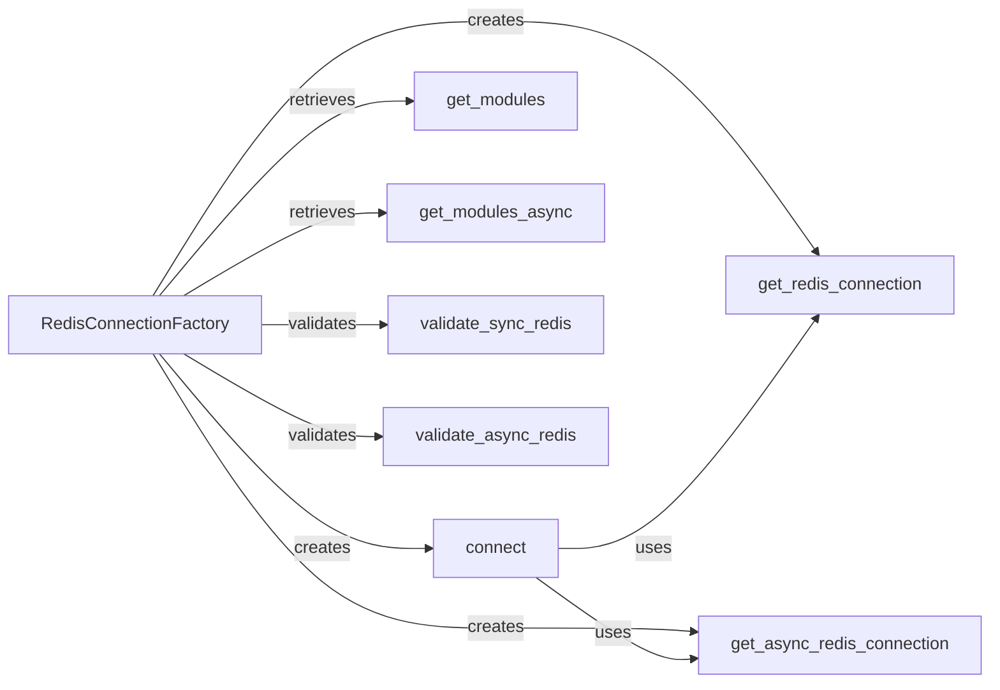

## Component Details

The Redis Connection Management component provides a centralized way to manage Redis connections, both synchronous and asynchronous, within the redisvl library. It uses the RedisConnectionFactory to create, validate, and retrieve Redis connections, abstracting the underlying connection details and ensuring consistent interaction with Redis instances. This component also handles the retrieval of Redis modules, providing a reliable and efficient mechanism for connecting to Redis.

### RedisConnectionFactory
A factory class responsible for creating and managing Redis connections (both synchronous and asynchronous). It encapsulates the logic for establishing connections, validating them, and retrieving available Redis modules. It acts as a central point for managing Redis connections within the library.
- **Related Classes/Methods**: `redisvl.redis.connection.RedisConnectionFactory`

### connect
Establishes a Redis connection based on the provided parameters. It uses the factory methods to create either a synchronous or asynchronous connection. This method serves as a high-level interface for obtaining a Redis connection.
- **Related Classes/Methods**: `redisvl.redis.connection.RedisConnectionFactory:connect`

### get_redis_connection
Creates a synchronous Redis connection using the redis-py library. It handles the actual connection establishment and returns a synchronous Redis client.
- **Related Classes/Methods**: `redisvl.redis.connection.RedisConnectionFactory:get_redis_connection`

### get_async_redis_connection
Creates an asynchronous Redis connection using the redis-py library. It handles the actual connection establishment and returns an asynchronous Redis client.
- **Related Classes/Methods**: `redisvl.redis.connection.RedisConnectionFactory:get_async_redis_connection`

### get_modules
Retrieves Redis modules from a synchronous connection. It queries the Redis server for the loaded modules and returns a list of module names.
- **Related Classes/Methods**: `redisvl.redis.connection.RedisConnectionFactory:get_modules`

### get_modules_async
Retrieves Redis modules from an asynchronous connection. It queries the Redis server for the loaded modules and returns a list of module names.
- **Related Classes/Methods**: `redisvl.redis.connection.RedisConnectionFactory:get_modules_async`

### validate_sync_redis
Validates a synchronous Redis connection by attempting a simple command. It ensures that the connection is active and functional.
- **Related Classes/Methods**: `redisvl.redis.connection.RedisConnectionFactory:validate_sync_redis`

### validate_async_redis
Validates an asynchronous Redis connection by attempting a simple command. It ensures that the connection is active and functional.
- **Related Classes/Methods**: `redisvl.redis.connection.RedisConnectionFactory:validate_async_redis`
