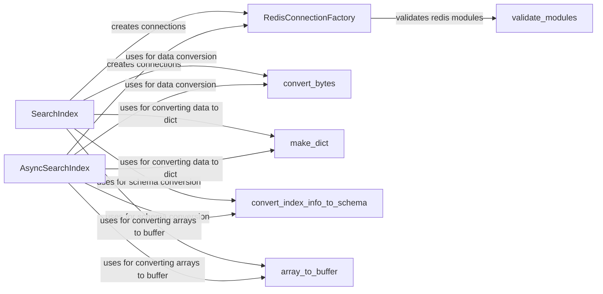

## Component Details

### RedisConnectionFactory
The RedisConnectionFactory is responsible for creating and managing both synchronous and asynchronous Redis connections. It handles connection pooling, validation of Redis clients, and loading necessary Redis modules. It acts as a central point for obtaining Redis connections, ensuring proper configuration and module availability.
- **Related Classes/Methods**: `redisvl.redis.connection.RedisConnectionFactory`

### convert_bytes
The `convert_bytes` utility function converts byte strings retrieved from Redis into standard Python strings, handling potential encoding issues. This ensures that data retrieved from Redis is properly decoded and can be used within the application, preventing encoding-related errors.
- **Related Classes/Methods**: `redisvl.redis.utils.convert_bytes`

### make_dict
The `make_dict` utility function converts data retrieved from Redis into Python dictionaries. This function transforms the raw data from Redis into a more structured and usable format for the application, facilitating easier data access and manipulation.
- **Related Classes/Methods**: `redisvl.redis.utils.make_dict`

### SearchIndex
The `SearchIndex` class represents a Redis search index and provides methods for connecting to an existing index, fetching data, and listing all indexes. It uses synchronous Redis connections to interact with the Redis database, providing a way to query and manage search indexes.
- **Related Classes/Methods**: `redisvl.index.index.SearchIndex`

### AsyncSearchIndex
The `AsyncSearchIndex` class represents an asynchronous Redis search index. It provides asynchronous methods for connecting to an existing index, fetching data, and listing all indexes. It interacts with Redis using asynchronous connections, enabling non-blocking operations for improved performance.
- **Related Classes/Methods**: `redisvl.index.index.AsyncSearchIndex`

### convert_index_info_to_schema
The `convert_index_info_to_schema` utility function converts index information retrieved from Redis into a schema representation. This function is used to dynamically generate a schema based on the existing index structure in Redis, allowing for flexible and adaptable data models.
- **Related Classes/Methods**: `redisvl.redis.connection.convert_index_info_to_schema`

### array_to_buffer
The `array_to_buffer` utility function converts numerical arrays into a byte buffer format suitable for storage and processing in Redis. This function is essential for efficiently storing and retrieving numerical data within Redis.
- **Related Classes/Methods**: `redisvl.redis.utils.array_to_buffer`

### validate_modules
The `validate_modules` utility function validates the presence and versions of required Redis modules. This function ensures that the necessary Redis modules are installed and compatible with the application, preventing runtime errors due to missing or incompatible modules.
- **Related Classes/Methods**: `redisvl.redis.connection.validate_modules`
