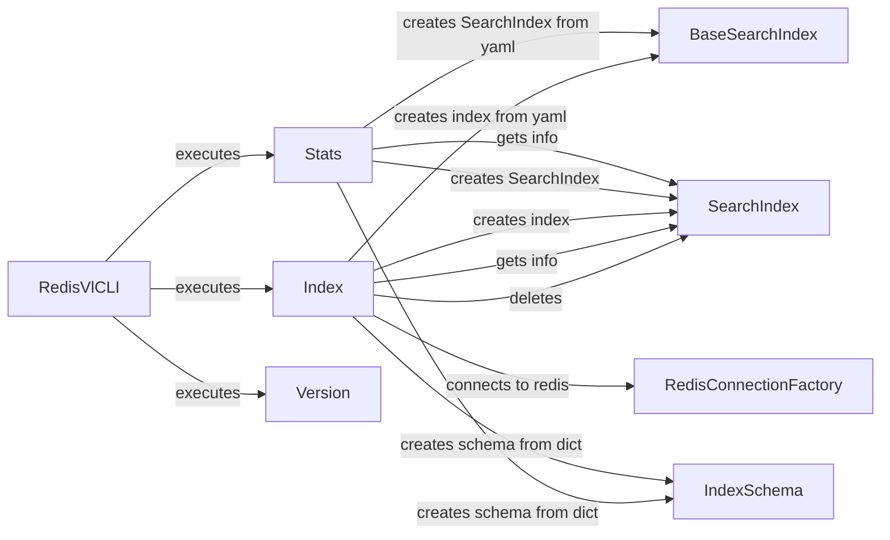

## Component Details

### RedisVlCLI
The main class for the redis-vl CLI, serving as the entry point for user interactions. It parses command-line arguments and dispatches commands to appropriate subcommands like index, version, and stats, managing the overall CLI workflow.
- **Related Classes/Methods**: `redisvl.cli.main.RedisVlCLI`

### Index
A subcommand of RedisVlCLI responsible for managing Redis indexes. It provides functionalities for creating, deleting, listing, and retrieving information about indexes, interacting with SearchIndex and BaseSearchIndex to perform index operations.
- **Related Classes/Methods**: `redisvl.cli.index.Index`

### Stats
A subcommand of RedisVlCLI that retrieves and displays statistics about a Redis index. It uses the SearchIndex class to fetch index information and formats the output for user readability, providing insights into index performance and usage.
- **Related Classes/Methods**: `redisvl.cli.stats.Stats`

### Version
A subcommand of RedisVlCLI that displays the version of the redis-vl library. It provides a simple way for users to check the installed version, ensuring compatibility and proper functioning.
- **Related Classes/Methods**: `redisvl.cli.version.Version`

### SearchIndex
Represents a Redis search index and provides methods for creating, deleting, and retrieving information about the index. It interacts directly with Redis to perform index operations, serving as a high-level interface for managing indexes.
- **Related Classes/Methods**: `redisvl.index.index.SearchIndex`

### BaseSearchIndex
A base class for Redis search indexes, providing common functionality such as connecting to Redis and defining key naming conventions. It serves as a foundation for more specialized index classes, promoting code reuse and consistency.
- **Related Classes/Methods**: `redisvl.index.index.BaseSearchIndex`

### IndexSchema
Represents the schema of a Redis index, defining the fields and their data types. It is used to create and validate index schemas, ensuring data integrity and efficient indexing.
- **Related Classes/Methods**: `redisvl.schema.schema.IndexSchema`

### RedisConnectionFactory
A factory class for creating Redis connections. It encapsulates the logic for establishing connections to Redis, including handling authentication and connection pooling, simplifying connection management and improving performance.
- **Related Classes/Methods**: `redisvl.redis.connection.RedisConnectionFactory`
