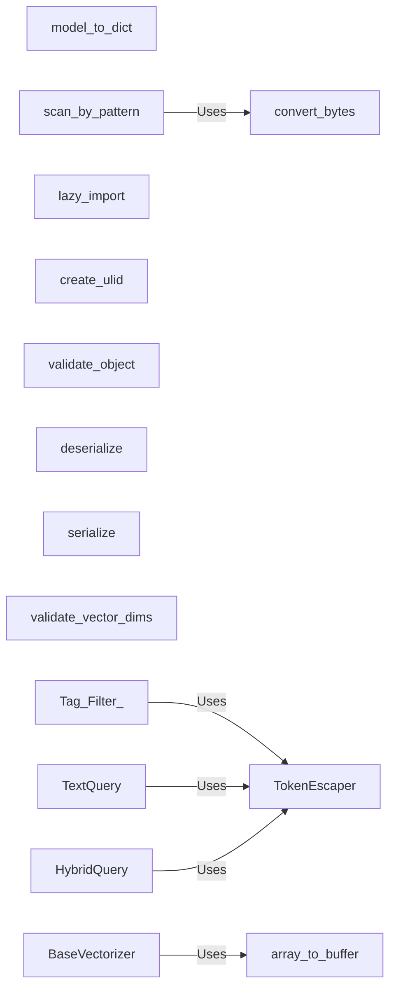

## Component Details

### TokenEscaper
The TokenEscaper component provides functionality to escape special characters in tokens, preventing injection vulnerabilities and ensuring correct parsing of queries. It is used by query processing components to sanitize input.
- **Related Classes/Methods**: `redisvl.utils.token_escaper.TokenEscaper`

### model_to_dict
The model_to_dict component is a utility function that converts a Pydantic model to a dictionary, serializing items as needed. It's used for data serialization within the system, particularly when preparing data for storage in Redis.
- **Related Classes/Methods**: `redisvl.utils.utils:model_to_dict`, `redisvl.utils.utils.model_to_dict.serialize_item`

### scan_by_pattern
The scan_by_pattern component is a utility function that scans keys in Redis by a given pattern and converts the byte responses to strings. It's used for key retrieval operations, providing a convenient way to find keys matching a specific pattern.
- **Related Classes/Methods**: `redisvl.utils.utils:scan_by_pattern`, `redisvl.redis.utils:convert_bytes`

### lazy_import
The lazy_import component is a utility function for lazy importing of modules, improving startup time by deferring imports until the module is actually used. This can significantly reduce the initial load time of the application.
- **Related Classes/Methods**: `redisvl.utils.utils:lazy_import`, `redisvl.utils.utils.lazy_import.LazyModule._import_module`

### create_ulid
The create_ulid component is a utility function to create a ULID (Universally Unique Lexicographically Sortable Identifier). ULIDs are used for generating unique identifiers that are also sortable, making them suitable for indexing and time-based queries.
- **Related Classes/Methods**: `redisvl.utils.utils:create_ulid`

### validate_object
The validate_object component is a utility function to validate an object against a schema, ensuring data integrity. It's used to enforce data structures and types, preventing errors caused by invalid data.
- **Related Classes/Methods**: `redisvl.schema.validation:validate_object`

### deserialize
The deserialize component is a utility function to deserialize data, converting it from a serialized format back into a Python object. It's used to reconstruct data that has been stored or transmitted in a serialized form.
- **Related Classes/Methods**: `redisvl.utils.utils:deserialize`

### serialize
The serialize component is a utility function to serialize data, converting it into a format suitable for storage or transmission. It's used to transform Python objects into a byte stream or string representation.
- **Related Classes/Methods**: `redisvl.utils.utils:serialize`

### validate_vector_dims
The validate_vector_dims component is a utility function to validate the dimensions of a vector, ensuring it meets the required specifications. It's used to enforce consistency in vector data, preventing errors caused by mismatched dimensions.
- **Related Classes/Methods**: `redisvl.utils.utils:validate_vector_dims`

### array_to_buffer
The array_to_buffer component is a utility function to convert a numerical array to a byte buffer, used for efficient storage and transmission of vector data. It's used to optimize the storage and transfer of vector embeddings.
- **Related Classes/Methods**: `redisvl.redis.utils:array_to_buffer`
