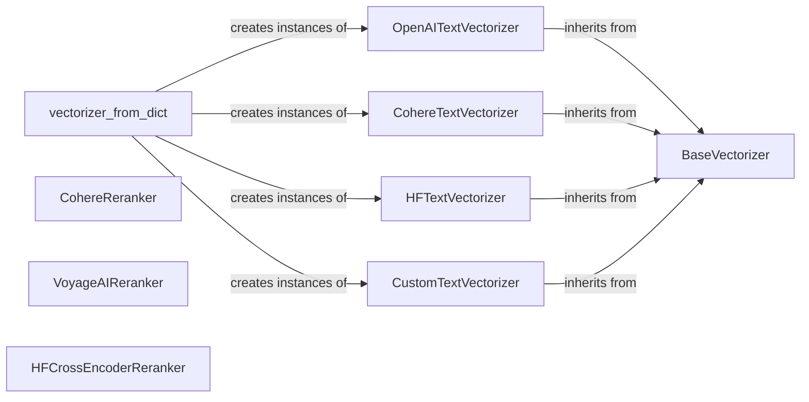

## Component Details

The Vectorization & Reranking component provides functionalities to convert text into vector embeddings and re-rank search results based on semantic similarity. It supports various vectorization models from providers like OpenAI, Cohere, Hugging Face, VoyageAI, MistralAI, Bedrock, AzureOpenAI, and VertexAI, as well as reranking models like Cohere and VoyageAI. The component enables the creation of vector representations for semantic search and improves the relevance and accuracy of search results by re-ordering the initial results based on semantic scores.

### BaseVectorizer
Abstract base class for vectorizers. Defines the common interface for embedding text and checking data types. It provides both synchronous and asynchronous embedding methods, serving as a foundation for specific vectorizer implementations.
- **Related Classes/Methods**: `redisvl.utils.vectorize.base.BaseVectorizer`

### OpenAITextVectorizer
Vectorizer that uses OpenAI's embedding models to convert text into vectors. It handles setup and embedding using the OpenAI API, providing a simple way to leverage OpenAI's powerful models for vectorization.
- **Related Classes/Methods**: `redisvl.utils.vectorize.text.openai.OpenAITextVectorizer`

### CohereTextVectorizer
Vectorizer that uses Cohere's embedding models to convert text into vectors. It handles setup, model dimension setting, and embedding using the Cohere API, allowing users to easily integrate Cohere's embedding capabilities.
- **Related Classes/Methods**: `redisvl.utils.vectorize.text.cohere.CohereTextVectorizer`

### HFTextVectorizer
Vectorizer that uses Hugging Face models to convert text into vectors. It handles model dimension setting and embedding using the Hugging Face Transformers library, providing flexibility to use various pre-trained models.
- **Related Classes/Methods**: `redisvl.utils.vectorize.text.huggingface.HFTextVectorizer`

### CustomTextVectorizer
Vectorizer that uses custom functions to convert text into vectors. It handles setup, validation, and embedding using user-provided functions, offering maximum flexibility for specialized vectorization needs.
- **Related Classes/Methods**: `redisvl.utils.vectorize.text.custom.CustomTextVectorizer`

### vectorizer_from_dict
A utility function that creates a vectorizer instance from a dictionary configuration. It acts as a factory for different vectorizer types, simplifying the creation and configuration of vectorizers.
- **Related Classes/Methods**: `redisvl.utils.vectorize:vectorizer_from_dict`

### CohereReranker
Reranker that uses Cohere's reranking models to reorder search results. It handles initialization and reranking using the Cohere API, improving search result relevance using Cohere's semantic understanding.
- **Related Classes/Methods**: `redisvl.utils.rerank.cohere.CohereReranker`

### VoyageAIReranker
Reranker that uses VoyageAI's reranking models to reorder search results. It handles initialization and reranking using the VoyageAI API, enhancing search accuracy with VoyageAI's reranking capabilities.
- **Related Classes/Methods**: `redisvl.utils.rerank.voyageai.VoyageAIReranker`

### HFCrossEncoderReranker
Reranker that uses Hugging Face cross-encoder models to reorder search results. It handles initialization and reranking using the Hugging Face Transformers library, providing a way to leverage powerful cross-encoders for improved ranking.
- **Related Classes/Methods**: `redisvl.utils.rerank.hf_cross_encoder.HFCrossEncoderReranker`
