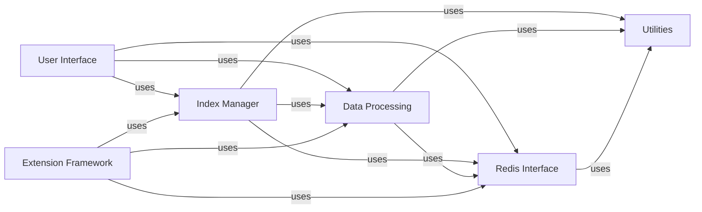

## Component Details

### User Interface
The User Interface component provides the primary means for users to interact with the RedisVL system. It encompasses both the command-line interface (CLI) and any potential future graphical user interfaces. This component is responsible for accepting user commands, displaying results, and managing the overall user experience.
- **Related Classes/Methods**: `redisvl.cli.main`, `redisvl.cli.index`, `redisvl.cli.stats`, `redisvl.cli.version`, `redisvl.cli.utils`, `redisvl.cli.runner`

### Index Manager
The Index Manager component is the core of RedisVL, responsible for managing the lifecycle of vector indexes within Redis. It handles index creation, deletion, connection management, schema definition, and search query execution. This component orchestrates the interaction between the schema, query, and Redis connection components to provide a unified interface for managing vector indexes.
- **Related Classes/Methods**: `redisvl.index.index`, `redisvl.index.storage`

### Data Processing
The Data Processing component focuses on transforming raw data into a suitable format for vector search. It includes functionalities for schema definition, data vectorization, query processing, and result optimization. This component ensures that data is properly structured, vectorized, and queried to achieve optimal search performance.
- **Related Classes/Methods**: `redisvl.schema.schema`, `redisvl.schema.fields`, `redisvl.schema.type_utils`, `redisvl.schema.validation`, `redisvl.query.query`, `redisvl.query.filter`, `redisvl.query.aggregate`, `redisvl.utils.vectorize`, `redisvl.utils.vectorize.base`, `redisvl.utils.vectorize.text`, `redisvl.utils.rerank`, `redisvl.utils.rerank.base`, `redisvl.utils.rerank.cohere`, `redisvl.utils.rerank.hf_cross_encoder`, `redisvl.utils.rerank.voyageai`, `redisvl.utils.optimize`, `redisvl.utils.optimize.base`, `redisvl.utils.optimize.cache`, `redisvl.utils.optimize.router`, `redisvl.utils.optimize.schema`, `redisvl.utils.optimize.utils`

### Redis Interface
The Redis Interface component manages the connection and communication with the Redis database. It provides functionalities for creating synchronous and asynchronous connections, validating Redis modules, and converting data between Python and Redis formats. This component acts as the bridge between the application logic and the Redis database.
- **Related Classes/Methods**: `redisvl.redis.connection`, `redisvl.redis.utils`

### Extension Framework
The Extension Framework component provides a modular architecture for extending RedisVL with additional features. It includes functionalities for LLM caching, embeddings caching, message history, semantic routing, and session management. This component allows developers to easily add new capabilities to RedisVL without modifying the core codebase.
- **Related Classes/Methods**: `redisvl.extensions.cache.llm`, `redisvl.extensions.cache.llm.base`, `redisvl.extensions.cache.llm.schema`, `redisvl.extensions.cache.llm.semantic`, `redisvl.extensions.cache.embeddings`, `redisvl.extensions.cache.embeddings.embeddings`, `redisvl.extensions.cache.embeddings.schema`, `redisvl.extensions.message_history`, `redisvl.extensions.message_history.base_history`, `redisvl.extensions.message_history.message_history`, `redisvl.extensions.message_history.schema`, `redisvl.extensions.message_history.semantic_history`, `redisvl.extensions.router`, `redisvl.extensions.router.schema`, `redisvl.extensions.router.semantic`, `redisvl.extensions.session_manager`, `redisvl.extensions.session_manager.base_session`, `redisvl.extensions.session_manager.schema`, `redisvl.extensions.session_manager.semantic_session`, `redisvl.extensions.session_manager.standard_session`

### Utilities
The Utilities component provides a collection of utility functions and classes used throughout the project. It includes functionalities for logging, token escaping, data serialization, and other common tasks. This component offers reusable tools and functionalities to support other components.
- **Related Classes/Methods**: `redisvl.utils.utils`, `redisvl.utils.log`, `redisvl.utils.token_escaper`