```mermaid
graph LR
    Index_Management["Index Management"]
    Query_Processing["Query Processing"]
    Data_Handling["Data Handling"]
    Vectorization_Reranking["Vectorization & Reranking"]
    CLI_Tooling["CLI Tooling"]
    Redis_Connection_Management["Redis Connection Management"]
    Extension_Framework["Extension Framework"]
    Index_Management -- "manages" --> Data_Handling
    Query_Processing -- "executes queries on" --> Index_Management
    Vectorization_Reranking -- "vectorizes data for" --> Index_Management
    Vectorization_Reranking -- "reranks results from" --> Query_Processing
    Index_Management -- "connects to" --> Redis_Connection_Management
    Extension_Framework -- "uses" --> Vectorization_Reranking
    Extension_Framework -- "uses" --> Index_Management
    Extension_Framework -- "uses" --> Redis_Connection_Management
    CLI_Tooling -- "manages indexes with" --> Index_Management
    Data_Handling -- "stores data in" --> Index_Management
    Index_Management -- "connects to redis with" --> Redis_Connection_Management
    click Index_Management href "https://github.com/CodeBoarding/GeneratedOnBoardings/blob/main/redis-vl-python/Index Management.md" "Details"
    click Query_Processing href "https://github.com/CodeBoarding/GeneratedOnBoardings/blob/main/redis-vl-python/Query Processing.md" "Details"
    click Data_Handling href "https://github.com/CodeBoarding/GeneratedOnBoardings/blob/main/redis-vl-python/Data Handling.md" "Details"
    click Vectorization_Reranking href "https://github.com/CodeBoarding/GeneratedOnBoardings/blob/main/redis-vl-python/Vectorization & Reranking.md" "Details"
    click CLI_Tooling href "https://github.com/CodeBoarding/GeneratedOnBoardings/blob/main/redis-vl-python/CLI Tooling.md" "Details"
    click Redis_Connection_Management href "https://github.com/CodeBoarding/GeneratedOnBoardings/blob/main/redis-vl-python/Redis Connection Management.md" "Details"
    click Extension_Framework href "https://github.com/CodeBoarding/GeneratedOnBoardings/blob/main/redis-vl-python/Extension Framework.md" "Details"
```

## Component Details

The redis-vl-python library provides a set of tools and abstractions for building vector-based search applications on top of Redis. It simplifies the process of creating, managing, and querying vector indexes, as well as integrating with various vectorization models and LLMs. The library offers components for defining index schemas, managing data storage, executing queries, and enhancing search results. It also includes extensions for LLM semantic caching, embeddings caching, semantic routing, and message history management, enabling advanced search and retrieval scenarios.

### Index Management
This component is responsible for the creation, deletion, and management of vector indexes within Redis. It provides a high-level interface for defining index schemas, connecting to Redis, and performing index-related operations. It serves as the central point for managing the lifecycle of Redis vector indexes, abstracting away the underlying Redis commands and data structures.
- **Related Classes/Methods**: `redisvl.index.index.SearchIndex`, `redisvl.index.index.AsyncSearchIndex`, `redisvl.index.index.BaseSearchIndex`, `redisvl.schema.schema.IndexSchema`, `redisvl.schema.fields.BaseField`, `redisvl.redis.connection.RedisConnectionFactory`

### Query Processing
This component handles the construction and execution of queries against a Redis index. It supports various query types, including vector similarity searches, text searches, and filtered queries. It provides mechanisms for combining different query types and processing the results, enabling complex search scenarios. It relies on the Index Management component to interact with the Redis index and retrieve data.
- **Related Classes/Methods**: `redisvl.query.query.BaseQuery`, `redisvl.query.query.VectorQuery`, `redisvl.query.query.TextQuery`, `redisvl.query.query.FilterQuery`, `redisvl.query.aggregate.HybridQuery`, `redisvl.query.filter.FilterExpression`, `redisvl.query.filter.Tag`, `redisvl.query.filter.Num`, `redisvl.query.filter.Geo`, `redisvl.query.filter.Text`, `redisvl.query.filter.Timestamp`

### Data Handling
This component manages the storage and retrieval of data within a Redis index. It provides methods for writing data to Redis, either synchronously or asynchronously, and for retrieving data by ID. It abstracts the underlying Redis data structures and provides a consistent interface for data access, supporting different storage strategies like storing data as hashes or JSON objects.
- **Related Classes/Methods**: `redisvl.index.storage.BaseStorage`, `redisvl.index.storage.HashStorage`, `redisvl.index.storage.JsonStorage`

### Vectorization & Reranking
This component provides utilities for converting text into vector embeddings and reranking search results based on semantic similarity. It supports various vectorization models, including OpenAI, Cohere, and Hugging Face models, as well as reranking models like Cohere and VoyageAI. It enables the creation of vector representations for semantic search and improves the relevance and accuracy of search results.
- **Related Classes/Methods**: `redisvl.utils.vectorize.base.BaseVectorizer`, `redisvl.utils.vectorize.text.openai.OpenAITextVectorizer`, `redisvl.utils.vectorize.text.cohere.CohereTextVectorizer`, `redisvl.utils.vectorize.text.huggingface.HFTextVectorizer`, `redisvl.utils.rerank.base.BaseReranker`, `redisvl.utils.rerank.cohere.CohereReranker`, `redisvl.utils.rerank.voyageai.VoyageAIReranker`

### CLI Tooling
The CLI Tooling component provides a command-line interface for interacting with RedisVL. It allows users to create, inspect, and delete indexes, as well as view statistics and version information. It serves as the entry point for users to manage their Redis vector indexes from the command line.
- **Related Classes/Methods**: `redisvl.cli.main.RedisVlCLI`, `redisvl.cli.index.Index`, `redisvl.cli.stats.Stats`, `redisvl.cli.version.Version`, `redisvl.cli.runner.main`

### Redis Connection Management
This component handles the connection to Redis, providing methods for creating and managing Redis clients, both synchronous and asynchronous. It abstracts the underlying Redis connection details and provides a consistent interface for interacting with Redis, ensuring that the library can connect to Redis instances in a reliable and efficient manner.
- **Related Classes/Methods**: `redisvl.redis.connection.RedisConnectionFactory`

### Extension Framework
This component provides extensions for LLM semantic caching, embeddings caching, semantic routing, and message history management. It leverages vector similarity search to enhance LLM performance, optimize embedding retrieval, route queries to appropriate indexes, and manage message histories effectively. These extensions provide advanced functionalities built on top of the core RedisVL capabilities.
- **Related Classes/Methods**: `redisvl.extensions.cache.llm.semantic.SemanticCache`, `redisvl.extensions.cache.llm.base.BaseLLMCache`, `redisvl.extensions.cache.llm.schema.CacheEntry`, `redisvl.extensions.cache.llm.schema.SemanticCacheIndexSchema`, `redisvl.extensions.cache.embeddings.embeddings.EmbeddingsCache`, `redisvl.extensions.cache.embeddings.schema.CacheEntry`, `redisvl.extensions.cache.base.BaseCache`, `redisvl.extensions.router.semantic.SemanticRouter`, `redisvl.extensions.router.schema.SemanticRouterIndexSchema`, `redisvl.extensions.router.schema.Route`, `redisvl.extensions.message_history.message_history.MessageHistory`, `redisvl.extensions.message_history.semantic_history.SemanticMessageHistory`, `redisvl.extensions.message_history.base_history.BaseMessageHistory`, `redisvl.extensions.message_history.schema.ChatMessage`, `redisvl.extensions.message_history.schema.MessageHistorySchema`, `redisvl.extensions.message_history.schema.SemanticMessageHistorySchema`